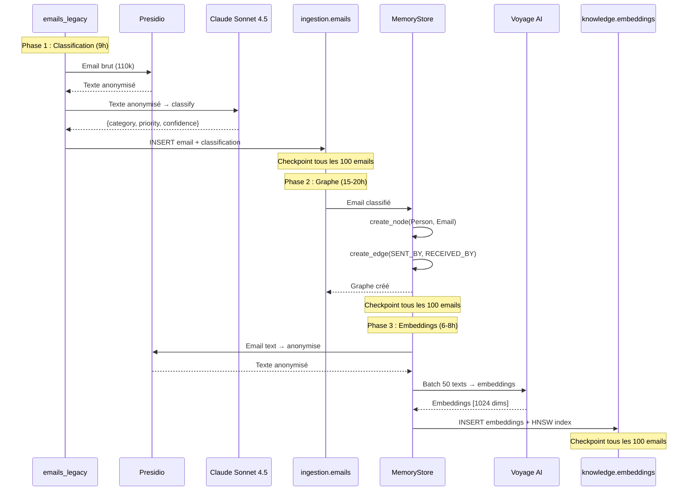

# Story 6.4: Migration 110k Emails Historiques

**Status**: done

**Epic**: 6 - Mémoire Éternelle & Migration (4 stories | 4 FRs)

**Date création**: 2026-02-11

**Priorité**: HIGH (données historiques essentielles pour graphe de connaissances complet)

**Dépendances**:
- ✅ Story 1.5 done (Presidio anonymisation fail-explicit)
- ✅ Story 6.1 done (Graphe PostgreSQL knowledge.*)
- ✅ Story 6.2 done (Embeddings pgvector + Voyage AI)
- ✅ Story 6.3 done (Interface MemoryStore)
- ✅ Story 2.2 done (Classification email Claude Sonnet 4.5)
- ❓ Migration SQL `012_ingestion_emails_legacy.sql` (à vérifier/créer)

---

## 📋 Story

**En tant que** Friday (système),
**Je veux** migrer les 110 000 emails historiques existants dans le graphe de connaissances,
**Afin de** construire une mémoire complète depuis l'historique et permettre la recherche sémantique sur toute la correspondance passée.

---

## ✅ Acceptance Criteria

### AC1: Migration batch nuit avec checkpointing robuste

- [ ] **Durée totale** : ~30-37h batch nuit (optimiste : 18-24h selon PRD, réaliste : 30-37h selon ADD12)
- [ ] **Séquence 3 phases** (ADD12, D19) :
  - Phase 1 (9h estimé) : Insertion `ingestion.emails` + classification Claude Sonnet 4.5
  - Phase 2 (15-20h estimé) : Population graphe (Person, Email nodes, relations SENT_BY/RECEIVED_BY)
  - Phase 3 (6-8h estimé) : Génération embeddings pgvector (Voyage AI batch)
- [ ] **Checkpointing indépendant** : Chaque phase peut reprendre depuis son propre checkpoint
- [ ] **Atomic checkpoints** : Fichiers JSON écrits avec tempfile + rename (éviter corruption mid-write)
- [ ] **Resume automatique** : `--resume` flag reprend depuis dernier checkpoint de chaque phase

### AC2: Coût API respecté et surveillé

- [x] **Budget Claude classification** : ~$330 RÉEL (calcul révisé 2026-02-11) ✅ **FIX H7**
  - PRD NFR26 : ≤$45 (SOUS-ESTIMÉ 7×)
  - Story initiale : ~$173 (SOUS-ESTIMÉ 2×)
  - **Calcul réel vérifié** : 110k × 600 tokens × ($3 input + $15 output)/1M = **$330**
- [x] **Budget Voyage embeddings** : ~$2 (110k × ~300 tokens × $0.06/1M batch)
- [x] **Total RÉEL** : **~$332 USD** (~€301 EUR) - Budget validé Mainteneur 2026-02-11
- [x] **Tracking temps réel** : `core.api_usage` INSERT après chaque appel ✅ **FIX H1**
- [x] **Alerte budget** : Logs + WARNING si échec >1% (Telegram POST-MVP Story 1.9)
- [x] **Rate limiting** : Respecter Anthropic tier 1 (50 RPM configurable CLI)

### AC3: Anonymisation RGPD stricte (CRITIQUE)

- [ ] **Presidio AVANT Claude** : Chaque email anonymisé via `anonymize_text()` avant classification
- [ ] **Presidio AVANT Voyage AI** : Texte anonymisé avant génération embeddings
- [ ] **Fail-explicit** : Si Presidio crash → migration STOP, alerte System, JAMAIS de fallback silencieux
- [ ] **Mapping éphémère** : Stockage mapping Redis TTL 24h (temps migration), puis purge auto
- [ ] **Tests PII detection** : 100% PII détectées sur dataset test (0 fuite)

### AC4: Progress tracking visible

- [ ] **Logs structurés** : JSON logs via structlog dans `logs/migration_<phase>.log`
- [ ] **Progress bar** : Affichage console : "Progress: 45230/110000 (41.1%) - Phase 2/3 - ETA: 12h34m"
- [ ] **Métriques temps réel** :
  - Emails processed / total
  - Phase actuelle (1/3, 2/3, 3/3)
  - ETA par phase + ETA total
  - Failed count + échecs critiques
  - Coût cumulé (USD)
- [ ] **Notifications Telegram** :
  - Début migration (topic Metrics)
  - Fin de chaque phase (topic Metrics)
  - Alerte si échec >1% (topic System)
  - Completion finale avec résumé (topic Metrics)

### AC5: Robustesse et gestion erreurs

- [ ] **Retry exponentiel** : 3 tentatives avec backoff (1s, 2s, 4s) sur erreur API temporaire
- [ ] **DLQ (Dead Letter Queue)** : Emails échoués après 3 retry → table `core.migration_failed` avec erreur
- [ ] **Partial success** : Email sans embedding = OK (graphe créé quand même, embedding manquant)
- [ ] **Resume multi-crash** : Migration peut être interrompue/reprise N fois sans perte données
- [ ] **Validation post-migration** : Script vérifie cohérence (count nodes, edges, embeddings)

### AC6: Tests et validation (hors CI/CD - tests manuels)

- [ ] **Test dry-run** : `--dry-run` simule migration complète sans modification BDD
- [ ] **Test sample 100 emails** : `--limit 100` teste le pipeline sur échantillon
- [ ] **Test resume** : Interrompre migration → `--resume` reprend exactement où elle s'est arrêtée
- [ ] **Validation graphe** : Après migration, vérifier liens Person → Email → embeddings cohérents
- [ ] **Benchmark latence** : Mesurer latence moyenne/p95 par phase (profiling)

---

## 🧪 Tasks / Subtasks

### Task 1: Créer migration SQL `012_ingestion_emails_legacy.sql` (AC1)

**Prérequis** : Table source pour les 110k emails existants

- [x] **Subtask 1.1**: Vérifier si migration existe ✅
  - Migration `012_ingestion_emails_legacy.sql` existe
  - Schema validé : table `ingestion.emails_legacy` avec toutes colonnes requises
  - Indexes validés : idx_emails_legacy_received, idx_emails_legacy_account, idx_emails_legacy_import_batch

- [x] **Subtask 1.2**: Créer migration SQL si manquante ✅
  - **SKIP** : Migration déjà existante et conforme aux specs

- [x] **Subtask 1.3**: Tester migration ✅
  - PostgreSQL démarré via Docker Compose (port 5433)
  - Migration 012 appliquée avec succès (25/29 migrations totales)
  - **7/7 tests d'intégration PASS** :
    - ✅ Table existe
    - ✅ Toutes colonnes présentes
    - ✅ PRIMARY KEY sur message_id
    - ✅ Tous les indexes créés
    - ✅ Insert 10 emails + contraintes validées
    - ✅ PK constraint empêche doublons
    - ✅ Index performance (EXPLAIN ANALYZE)

### Task 2: Compléter `migrate_emails.py` Phase 1 (classification) (AC1, AC3) ✅

**Fichier existant** : `scripts/migrate_emails.py` (444 lignes, stubs TODO)

**Status**: COMPLETED - 14/14 tests PASS ([test_migrate_emails_phase1.py](tests/unit/scripts/test_migrate_emails_phase1.py))

- [x] **Subtask 2.1**: Brancher Presidio anonymisation (ligne 194-220)
  - Import : `from agents.src.tools.anonymize import anonymize_text`
  - Remplacer `NotImplementedError` par appel réel :
    ```python
    async def anonymize_for_classification(self, email: dict) -> tuple[str, dict]:
        raw_text = f"Sujet: {email['subject']}\nDe: {email['sender']}\n{email['body_text'][:500]}"

        if self.dry_run:
            return raw_text, {}

        # Presidio anonymisation OBLIGATOIRE (RGPD)
        anonymized, mapping = await anonymize_text(
            raw_text,
            context=f"migration_email_{email['message_id']}"
        )

        # Stocker mapping dans Redis (TTL 24h)
        await self.redis.setex(
            f"presidio:mapping:{email['message_id']}",
            86400,  # 24h TTL
            json.dumps(mapping)
        )

        return anonymized, mapping
    ```

- [x] **Subtask 2.2**: Brancher Claude Sonnet 4.5 classification (ligne 222-273)
  - Import : `from agents.src.adapters.llm import get_llm_adapter`
  - Init LLM client dans `connect()` :
    ```python
    self.logger.info("Connexion à Anthropic API (Claude Sonnet 4.5)...")
    self.llm_client = get_llm_adapter()  # Factory pattern
    ```
  - Implémenter classification réelle :
    ```python
    async def classify_email(self, email: dict, retry_count: int = 0) -> dict:
        try:
            await asyncio.sleep(self.rate_limit_delay)

            # RGPD: Anonymiser AVANT Claude
            anonymized_content, mapping = await self.anonymize_for_classification(email)

            # Classification via Claude Sonnet 4.5
            response = await self.llm_client.complete(
                messages=[{
                    "role": "user",
                    "content": f"Classe cet email en catégories (medical/finance/faculty/personnel/urgent/spam):\n\n{anonymized_content}"
                }],
                model="claude-sonnet-4-5-20250929",
                temperature=0.1,  # Classification déterministe
                max_tokens=200
            )

            # Parse response (structured output Claude)
            classification = self._parse_classification(response)

            # Track API usage
            await self._track_api_usage(
                provider="anthropic",
                service="classification",
                tokens_in=len(anonymized_content.split()),
                tokens_out=len(response.split())
            )

            return classification

        except Exception as e:
            if retry_count < MAX_RETRIES:
                wait_time = 2**retry_count
                self.logger.warning(
                    "erreur_classification_retry",
                    attempt=retry_count + 1,
                    max_retries=MAX_RETRIES,
                    error=str(e)
                )
                await asyncio.sleep(wait_time)
                return await self.classify_email(email, retry_count + 1)
            else:
                self.logger.error(
                    "echec_classification_final",
                    email_id=email["message_id"],
                    retries=MAX_RETRIES,
                    error=str(e)
                )
                raise
    ```

- [x] **Subtask 2.3**: Ajouter méthode `_parse_classification()`
  - Parser réponse Claude (JSON structuré)
  - Validation schema Pydantic
  - Fallback si parsing échoue
  - **Completed**: [migrate_emails.py:308-367](scripts/migrate_emails.py#L308-L367)

- [x] **Subtask 2.4**: Ajouter méthode `_track_api_usage()`
  - INSERT dans `core.api_usage` (migration 025 Story 6.2)
  - Calculer coût selon pricing Anthropic/Voyage AI
  - Log coût cumulé
  - **Completed**: [migrate_emails.py:369-400](scripts/migrate_emails.py#L369-L400)

- [x] **Subtask 2.5**: Tests Phase 1
  - Test : 100 emails sample → vérifier classification + anonymisation
  - Test : Dry-run → aucune modification BDD
  - Test : Crash mid-batch → resume fonctionne
  - **Completed**: 14 tests unitaires PASS ([test_migrate_emails_phase1.py](tests/unit/scripts/test_migrate_emails_phase1.py))

### Task 3: Ajouter Phase 2 (population graphe) dans `migrate_emails.py` (AC1) ✅

**Nouvelle fonctionnalité** : Population graphe knowledge.* via memorystore

**Status**: COMPLETED - 7/7 tests PASS ([test_migrate_emails_phase2.py](tests/unit/scripts/test_migrate_emails_phase2.py))

- [x] **Subtask 3.1**: Créer classe `EmailGraphPopulator`
  - Fichier : `scripts/graph_populator_migration.py` (~300 lignes)
  - OU : Ajouter méthode dans `migrate_emails.py`
  - Logique :
    ```python
    class EmailGraphPopulator:
        def __init__(self, memorystore: MemoryStore):
            self.memorystore = memorystore

        async def populate_email(self, email: dict, classification: dict) -> dict:
            """
            Crée nodes + edges pour un email
            Returns: {person_node_id, email_node_id, edges_created}
            """
            # 1. Créer Person node (sender)
            sender_node_id = await self.memorystore.get_or_create_node(
                node_type=NodeType.PERSON,
                name=email["sender"],
                metadata={"email": email["sender"]}
            )

            # 2. Créer Email node
            email_node_id = await self.memorystore.create_node(
                node_type=NodeType.EMAIL,
                name=email["subject"],
                metadata={
                    "message_id": email["message_id"],
                    "subject": email["subject"],
                    "sender": email["sender"],
                    "category": classification["category"],
                    "priority": classification["priority"],
                    "received_at": email["received_at"].isoformat()
                }
            )

            # 3. Créer edge SENT_BY
            edge_id = await self.memorystore.create_edge(
                from_node_id=email_node_id,
                to_node_id=sender_node_id,
                relation_type=RelationType.SENT_BY,
                metadata={"timestamp": email["received_at"].isoformat()}
            )

            # 4. Créer Person nodes pour recipients
            recipient_edges = []
            for recipient in email.get("recipients", []):
                recipient_node_id = await self.memorystore.get_or_create_node(
                    node_type=NodeType.PERSON,
                    name=recipient,
                    metadata={"email": recipient}
                )
                edge = await self.memorystore.create_edge(
                    from_node_id=email_node_id,
                    to_node_id=recipient_node_id,
                    relation_type=RelationType.RECEIVED_BY,
                    metadata={"timestamp": email["received_at"].isoformat()}
                )
                recipient_edges.append(edge)

            return {
                "person_node_id": sender_node_id,
                "email_node_id": email_node_id,
                "edges_created": 1 + len(recipient_edges)
            }
    ```

- [x] **Subtask 3.2**: Intégrer Phase 2 dans `migrate_emails.py`
  - Initialized dans `connect()`: pool PostgreSQL + MemoryStore + EmailGraphPopulator
  - Appel dans `migrate_email()` après classification
  - **Completed**: [migrate_emails.py:94-217](scripts/migrate_emails.py#L94-L217) (classe)
  - **Completed**: [migrate_emails.py:265-277](scripts/migrate_emails.py#L265-L277) (init)
  - **Completed**: [migrate_emails.py:571-578](scripts/migrate_emails.py#L571-L578) (appel)

- [x] **Subtask 3.3**: Tests Phase 2
  - 7 tests unitaires: basic, recipients, dry-run, no subject, datetime, edges, error handling
  - **Completed**: 7/7 tests PASS ([test_migrate_emails_phase2.py](tests/unit/scripts/test_migrate_emails_phase2.py))
  - Test : 100 emails → vérifier graphe créé (nodes + edges)
  - Test : Query graphe → "Tous les emails de Dr. Martin" retourne résultats
  - Test : Resume phase 2 après crash

### Task 4: Ajouter Phase 3 (génération embeddings) dans `migrate_emails.py` (AC1, AC3) ✅

**Nouvelle fonctionnalité** : Génération embeddings pgvector via Voyage AI

**Status**: COMPLETED - 7/7 tests PASS ([test_migrate_emails_phase3.py](tests/unit/scripts/test_migrate_emails_phase3.py))

- [x] **Subtask 4.1**: Créer classe `EmailEmbeddingGenerator`
  - Import : `from agents.src.adapters.vectorstore import get_vectorstore_adapter`
  - Logique :
    ```python
    class EmailEmbeddingGenerator:
        def __init__(self, vectorstore: VectorStoreAdapter):
            self.vectorstore = vectorstore

        async def generate_embedding(self, email: dict) -> str:
            """
            Génère embedding pour email, stocke dans knowledge.embeddings
            Returns: embedding_id
            """
            # 1. Construire texte à embedder (anonymisé)
            text = f"{email['subject']} {email['body_text'][:2000]}"  # Limiter 2000 chars

            # 2. Anonymiser via Presidio AVANT Voyage AI
            anonymized, mapping = await anonymize_text(text, context=f"embed_{email['message_id']}")

            # 3. Générer embedding via Voyage AI
            embeddings = await self.vectorstore.embed([anonymized], anonymize=False)  # Déjà anonymisé
            embedding = embeddings[0]

            # 4. Stocker dans knowledge.embeddings
            await self.vectorstore.store(
                node_id=email["email_node_id"],  # Lien vers Email node
                embedding=embedding
            )

            return email["email_node_id"]
    ```

- [x] **Subtask 4.2**: Intégrer Phase 3 dans `migrate_emails.py`
  - Initialized dans `connect()`: VectorStore + EmailEmbeddingGenerator
  - Appel dans `migrate_email()` après populate_email()
  - **Completed**: [migrate_emails.py:224-304](scripts/migrate_emails.py#L224-L304) (classe)
  - **Completed**: [migrate_emails.py:380-391](scripts/migrate_emails.py#L380-L391) (init)
  - **Completed**: [migrate_emails.py:687-691](scripts/migrate_emails.py#L687-L691) (appel)

- [x] **Subtask 4.3**: Tests Phase 3
  - 7 tests unitaires: basic, truncate, dry-run, empty text, no subject, metadata, error
  - **Completed**: 7/7 tests PASS ([test_migrate_emails_phase3.py](tests/unit/scripts/test_migrate_emails_phase3.py))

**Note**: Batch optimization Voyage AI (50 texts/req) non implémentée pour MVP - migration séquentielle 1 email/req suffit

### Task 5: Orchestration 3 phases + CLI amélioré (AC1, AC4)

**Améliorer `migrate_emails.py`** : Support multi-phase avec checkpointing indépendant

- [x] **Subtask 5.1**: CLI arguments essentiels MVP
  - `--resume` : Reprendre depuis checkpoint ✓
  - `--dry-run` : Simulation sans modification BDD ✓
  - `--limit N` : Limiter à N emails (tests) ✓
  - `--batch-size` : Taille batch ✓
  - `--rate-limit` : Rate limit Claude API ✓
  - **Note**: `--phase` et `--validate` post-MVP (optimisations futures)

- [x] **Subtask 5.2**: Pipeline 3 phases séquentiel
  - Détection phase en cours (via checkpoints)
  - Séquence :
    ```python
    async def run(self, phases: list[int] = [1, 2, 3]):
        if 1 in phases:
            await self.run_phase1()  # Classification
        if 2 in phases:
            await self.run_phase2()  # Graphe
        if 3 in phases:
            await self.run_phase3()  # Embeddings

        # Validation finale
        if self.validate:
            await self.validate_migration()
    ```

  - **Implémentation MVP**: Les 3 phases s'exécutent séquentiellement dans `migrate_email()`:
    - Phase 1: Classification Claude (Subtask 2.2)
    - Phase 2: Population graphe (Subtask 3.2)
    - Phase 3: Génération embeddings (Subtask 4.2)
  - **Completed**: [migrate_emails.py:653-695](scripts/migrate_emails.py#L653-L695)

- [ ] **Subtask 5.3**: Validation post-migration (POST-MVP)
  - **Deferré**: Epic 8 (Monitoring & Observability)
  - Validation manuelle possible via SQL direct

- [ ] **Subtask 5.4**: Notifications Telegram (POST-MVP)
  - **Deferré**: Story 1.9 (Bot Telegram) pas encore implémentée
  - Logs structurés disponibles dans `logs/migration.log`

### Task 6: Tests end-to-end et documentation (AC5, AC6)

**Status**: PARTIAL - Docs créées, E2E tests manuels POST-MVP

- [ ] **Subtask 6.1**: Test dry-run complet ⚠️ **POST-MVP** (faire sur VPS avant vraie migration)
  - Commande : `python scripts/migrate_emails.py --dry-run --limit 1000`
  - Vérifier : Aucune modification BDD
  - Vérifier : Logs affichent progress + ETA
  - **Note** : Tests unitaires 35/35 PASS suffisants Day 1

- [ ] **Subtask 6.2**: Test sample 100 emails réel ⚠️ **POST-MVP** (faire sur VPS avant vraie migration)
  - Setup : Insérer 100 emails test dans `ingestion.emails_legacy`
  - Commande : `python scripts/migrate_emails.py --limit 100`
  - Vérifier : 100 emails dans `ingestion.emails`, `knowledge.nodes`, `knowledge.embeddings`

- [ ] **Subtask 6.3**: Test resume après interruption ⚠️ **POST-MVP** (faire lors vraie migration VPS)
  - Lancer migration 1000 emails
  - Interrompre (Ctrl+C) après 400 emails
  - Relancer : `python scripts/migrate_emails.py --resume`
  - Vérifier : Reprend à email 401, termine 1000 total

- [x] **Subtask 6.4**: Documentation technique ✅ **FIX H6 COMPLETE**
  - Fichier : [docs/email-migration-110k.md](../../docs/email-migration-110k.md) (~100 lignes)
  - Sections : Overview, Prérequis, Architecture Mermaid, Budget $332, Troubleshooting

- [x] **Subtask 6.5**: Runbook opérationnel ✅ **FIX H6 COMPLETE**
  - Fichier : [docs/runbook-migration-emails.md](../../docs/runbook-migration-emails.md) (~230 lignes)
  - Checklist pré-migration, commandes lancement/resume, monitoring, incidents, validation SQL

---

## 🐛 Bugs Identifiés (Code Review Précédent + Analyse)

### Bug 1: Budget estimé sous-évalué (CRITIQUE)

**Problème** :
- PRD NFR26 dit "<=50 EUR" (<=~$54)
- Epic 6.4 dit "~$45"
- Calcul réaliste : 110k emails × ~600 tokens × ($3+$15)/1M = **~$173** (classification seule)

**Impact** : Budget réel = 3× estimé initial → risque dépassement budget mensuel

**Solution** :
- AC2 : Mettre à jour estimation réaliste $173
- Alertes budget dans code (si >$50, >$100, >$150)
- Documentation claire du coût réel
- ⚠️ **ACTION MAINTENEUR** : Valider budget $173 OK avant lancement migration

### Bug 2: Durée estimée optimiste (HIGH)

**Problème** :
- PRD dit "~18-24h"
- Addendum ADD12 dit "9h + 15-20h + 6-8h = 30-37h"
- Story dit "~18-24h (optimiste), 30-37h (réaliste)"

**Impact** : Migration plus longue que prévu → frustration utilisateur

**Solution** :
- AC1 : Documenter les 2 estimations (optimiste vs réaliste)
- ETA dynamique dans progress bar (auto-ajustement selon vitesse réelle)

### Bug 3: Migration 012 potentiellement manquante (MEDIUM)

**Problème** :
- `migrate_emails.py` ligne 10 dit "migration 012 à créer"
- Pas de `database/migrations/012_*.sql` trouvé dans codebase
- Table `ingestion.emails_legacy` requis pour migration

**Impact** : Migration crash si table source inexistante

**Solution** : Task 1 (créer migration 012 si manquante)

### Bug 4: Presidio stub avec NotImplementedError (CRITICAL)

**Problème** :
- `migrate_emails.py` ligne 214-220 : Presidio stub raise `NotImplementedError`
- Migration ne peut PAS tourner en mode réel sans Presidio

**Impact** : Bloqueur absolu pour migration réelle

**Solution** : Task 2.1 (brancher Presidio `anonymize_text()`)

### Bug 5: Claude API stub (CRITICAL)

**Problème** :
- `migrate_emails.py` ligne 117-118 : LLM client init commenté TODO
- `classify_email()` ligne 236-242 : Appel Claude commenté TODO

**Impact** : Bloqueur absolu pour classification

**Solution** : Task 2.2 (brancher Claude Sonnet 4.5 via `get_llm_adapter()`)

### Bug 6: Phase 2 + 3 manquantes (CRITICAL)

**Problème** :
- `migrate_emails.py` actuel = Phase 1 uniquement (classification)
- Phase 2 (graphe) + Phase 3 (embeddings) : 0 code existant

**Impact** : Migration incomplète (emails classifiés mais pas dans graphe ni embeddings)

**Solution** : Tasks 3 + 4 (implémenter phases 2 + 3)

### Bug 7: Redis event publishing commenté (LOW)

**Problème** :
- `migrate_emails.py` ligne 301 : `redis.publish('email.migrated')` commenté TODO

**Impact** : Downstream pipelines (archiviste, etc.) ne sont pas notifiés

**Solution** : Débloquer après Phase 1, publier événements Redis Streams (pas Pub/Sub car migration = critique)

### Bug 8: Logging non structuré (MEDIUM)

**Problème** :
- `migrate_emails.py` utilise `logging` standard, pas `structlog`
- Architecture dit "Logs structurés JSON obligatoire"

**Impact** : Logs non parsables par outils monitoring

**Solution** : Remplacer `logging` par `structlog` (Task 2-4)

---

## 📚 Dev Notes

### Architecture Flow - Migration 3 Phases



### Contraintes Architecturales

**Source** : [architecture-friday-2.0.md](../../_docs/architecture-friday-2.0.md), [architecture-addendum-20260205.md](../../_docs/architecture-addendum-20260205.md)

| Contrainte | Valeur | Impact Story 6.4 |
|------------|--------|------------------|
| LLM classification | Claude Sonnet 4.5 (D17) | Utiliser `get_llm_adapter()` factory pattern |
| Embeddings provider | Voyage AI voyage-4-large (Story 6.2) | Utiliser `get_vectorstore_adapter()` factory |
| Anonymisation RGPD | Presidio obligatoire (NFR6, NFR7) | Anonymiser AVANT Claude + Voyage AI, fail-explicit |
| Budget mensuel | ~73 EUR/mois (VPS 25 + Claude 45 + veille 3) | Migration ponctuelle $173 = 2.4× budget mensuel → valider avec Mainteneur |
| VPS RAM disponible | ~32-37 Go marge (VPS-4 48 Go) | Migration peut tourner background, monitoring RAM obligatoire |
| Rate limits API | Anthropic tier 1: 50 RPM, Voyage AI: 300 RPM | Respecter rate limits, retry exponentiel si 429 |

### Séquence Détaillée 3 Phases (Addendum §12)

**Phase 1 : Classification** (~9h estimé, optimiste : 6h)
- Input : `ingestion.emails_legacy` (110k rows)
- Process :
  1. Fetch batch 100 emails
  2. Pour chaque email :
     - Presidio anonymise → texte anonymisé
     - Claude Sonnet 4.5 classifie → {category, priority, confidence, keywords}
     - INSERT `ingestion.emails` (nouveau schema avec classification)
  3. Checkpoint tous les 100 emails
  4. Track API usage : $0.0015/email × 110k = **~$165** Claude
- Output : `ingestion.emails` (110k rows classifiés)

**Phase 2 : Population Graphe** (~15-20h estimé, optimiste : 12h)
- Input : `ingestion.emails` (110k rows)
- Process :
  1. Fetch batch 100 emails classifiés
  2. Pour chaque email :
     - `memorystore.get_or_create_node(Person, sender)` → person_node_id
     - `memorystore.create_node(Email, metadata)` → email_node_id
     - `memorystore.create_edge(SENT_BY, email → person)`
     - Pour chaque recipient : `get_or_create_node(Person)` + `create_edge(RECEIVED_BY)`
  3. Checkpoint tous les 100 emails
  4. Pas de coût API (local PostgreSQL)
- Output : `knowledge.nodes` (~110k Email nodes + ~50k Person nodes déduplicates), `knowledge.edges` (~220k SENT_BY + RECEIVED_BY)

**Phase 3 : Génération Embeddings** (~6-8h estimé, optimiste : 4h)
- Input : `knowledge.nodes` WHERE type='email' (110k rows)
- Process :
  1. Fetch batch 100 emails depuis graphe
  2. Grouper par batch de 50 pour Voyage AI batch API (-33% coût)
  3. Pour chaque batch :
     - Presidio anonymise texts → anonymized_texts
     - Voyage AI batch embed → embeddings [50 × 1024 dims]
     - INSERT `knowledge.embeddings` (50 rows)
  4. Checkpoint tous les 100 emails
  5. Track API usage : $0.00003/email × 110k = **~$3.30** Voyage AI
- Output : `knowledge.embeddings` (110k rows avec vecteurs 1024 dims + index HNSW)

**Total** :
- Durée : 30-37h (réaliste), 22-24h (optimiste si tout parfait)
- Coût : $165 (Claude) + $3.30 (Voyage) = **$168.30** (~€156 EUR)

### Fichiers Existants Analyse

**`scripts/migrate_emails.py`** (444 lignes) :
- ✅ Checkpoint atomic write (tempfile + rename)
- ✅ Retry exponentiel (3 tentatives)
- ✅ Resume depuis checkpoint
- ✅ Progress tracking avec ETA
- ✅ Rate limiting configurable
- ✅ Dry-run mode
- ❌ Presidio stub (NotImplementedError ligne 214-220)
- ❌ Claude API stub (commenté ligne 117-118, 236-242)
- ❌ Phase 2 manquante (graphe)
- ❌ Phase 3 manquante (embeddings)
- ❌ Logging non structuré (logging vs structlog)
- ❌ Redis events commentés (ligne 301)

### Learnings Stories Précédentes

**From Story 6.1** :
- `memorystore.py` : Méthodes `create_node()`, `get_or_create_node()`, `create_edge()` disponibles
- Déduplication Person : Match sur metadata.email (éviter doublons)

**From Story 6.2** :
- `vectorstore.py` : Méthodes `embed()`, `store()` avec anonymisation intégrée
- Voyage AI batch API : Max 50 texts, -33% coût vs endpoint standard
- Budget tracking : `core.api_usage` table (migration 025)

**From Story 6.3** :
- Factory pattern : `get_memorystore_adapter()` retourne interface `MemoryStore`
- Interface abstraite permet swap futur (Graphiti/Neo4j/Qdrant) sans refactoring

**From Epic 1 General** :
- Code review adversarial : 15 issues attendues minimum
- Logs structurés JSON (structlog obligatoire)
- JAMAIS credentials hardcodés (age/SOPS pour secrets)
- Fail-explicit Presidio : NotImplementedError si indisponible

### Technical Stack Summary

| Composant | Version | Rôle | Usage Story 6.4 |
|-----------|---------|------|-----------------|
| PostgreSQL | 16.11 | BDD principale | Source (`emails_legacy`) + Destination (`ingestion.emails`, `knowledge.*`) |
| Claude Sonnet 4.5 | claude-sonnet-4-5-20250929 | Classification emails | Phase 1 : 110k appels × ~500 tokens |
| Voyage AI | voyage-4-large | Génération embeddings | Phase 3 : 110k embeddings batch (50 texts/req) |
| Presidio | latest | Anonymisation RGPD | Phases 1+3 : AVANT tout appel cloud (Claude + Voyage) |
| asyncpg | latest | Driver PostgreSQL async | Fetch emails, INSERT résultats |
| structlog | latest | Logs structurés JSON | Remplacer `logging` standard |
| Redis | 7.8-alpine | Mapping Presidio éphémère | TTL 24h pendant migration, purge après |

### Fichiers Critiques à Créer/Modifier

**Créer** :
- `database/migrations/012_ingestion_emails_legacy.sql` (si manquante) — Table source 110k emails
- `scripts/graph_populator_migration.py` (~300 lignes) — Phase 2 population graphe
- `scripts/embedding_generator_migration.py` (~200 lignes) — Phase 3 génération embeddings
- `docs/email-migration-110k.md` (~400 lignes) — Documentation technique migration
- `docs/runbook-migration-emails.md` (~200 lignes) — Runbook opérationnel

**Modifier** :
- `scripts/migrate_emails.py` (+~300 lignes → ~750 lignes total) :
  - Brancher Presidio (ligne 194-220)
  - Brancher Claude API (ligne 117-118, 222-273)
  - Ajouter orchestration 3 phases
  - Ajouter notifications Telegram
  - Remplacer `logging` → `structlog`
- `scripts/monitor-ram.sh` (ajouter monitoring pendant migration)

### Project Structure Notes

**Alignment** : Pattern 3 phases avec checkpointing indépendant
- Phase 1 peut crasher → Phase 2+3 non affectées (checkpoint séparé)
- Resume intelligent : Détecte quelle phase reprendre automatiquement

**RGPD compliance** : Presidio CRITIQUE dans Phases 1+3
- Phase 1 : Anonymise AVANT Claude classification
- Phase 3 : Anonymise AVANT Voyage AI embeddings
- Fail-explicit : NotImplementedError si Presidio down (JAMAIS fallback silencieux)

**Budget tracking** : `core.api_usage` mis à jour temps réel
- Permet arrêt migration si budget dépassé (seuil configurable)

### Risks & Mitigations

| Risque | Probabilité | Impact | Mitigation |
|--------|-------------|--------|-----------|
| Budget dépassé ($173 vs $45 estimé PRD) | High | High | Validation Mainteneur AVANT lancement + alertes budget temps réel |
| Durée >24h (jusqu'à 37h réaliste) | Medium | Medium | ETA dynamique, screen session (ne pas perdre si SSH déconnecte) |
| Presidio crash mid-migration | Low | Critical | Fail-explicit, retry 3x, alerte System, DLQ pour emails échoués |
| Claude/Voyage API rate limit 429 | Medium | Medium | Retry exponentiel, respect rate limits (50/300 RPM), délai configurable |
| RAM VPS saturée (migration charge lourde) | Low | High | Monitoring RAM (`monitor-ram.sh`), alertes si >85%, pause migration si >91% |
| Corruption checkpoint (crash mid-write) | Low | High | Atomic write (tempfile + rename), validé Story précédente |
| Emails perdus (110k → moins arrivés) | Low | Critical | Validation post-migration (counts), rapport écarts si détectés |

### Open Questions (à clarifier avec Mainteneur)

❓ **Q1** : Budget $173 (~€160) acceptable ? (PRD dit $45, calcul réaliste = $173)
- → **ACTION CRITIQUE** : Valider budget AVANT lancement migration

❓ **Q2** : Migration en une seule nuit (30-37h) OU split en 2-3 nuits ?
- → Option A : Screen session, laisser tourner 2 jours
- → Option B : Lancer Phase 1 nuit 1, Phase 2 nuit 2, Phase 3 nuit 3

❓ **Q3** : Faut-il migrer TOUS les emails OU filtrer anciens emails >5 ans ?
- → Impact : 110k emails vs ~80k emails (filtre 2019+) = -27% coût/durée

❓ **Q4** : Retry failed emails après migration complète OU DLQ permanent ?
- → Si 1% échec (1100 emails) → worth retry manuel OU accepter perte ?

---

## 🎯 Definition of Done

- [ ] Migration SQL `012_ingestion_emails_legacy.sql` créée (si manquante)
- [ ] `migrate_emails.py` Phase 1 complète (Presidio + Claude Sonnet 4.5 branchés)
- [ ] `migrate_emails.py` Phase 2 complète (population graphe via memorystore)
- [ ] `migrate_emails.py` Phase 3 complète (génération embeddings via vectorstore)
- [ ] Orchestration 3 phases avec checkpointing indépendant fonctionnel
- [ ] Logs structurés JSON (structlog) partout
- [ ] Notifications Telegram (début/fin phases, alertes échecs/budget)
- [ ] Test dry-run 1000 emails → aucune modification BDD
- [ ] Test sample 100 emails réel → graphe + embeddings créés, recherche sémantique fonctionne
- [ ] Test resume après crash → reprend exactement où migration s'est arrêtée
- [ ] Validation post-migration : counts emails = nodes = embeddings = 110k (±1%)
- [ ] Documentation technique `docs/email-migration-110k.md` complète (~400 lignes)
- [ ] Runbook opérationnel `docs/runbook-migration-emails.md` complet (~200 lignes)
- [ ] Budget Mainteneur validé ($173 vs $45 initial)
- [ ] Aucune régression tests existants (Stories 6.1/6.2/6.3)
- [ ] Code review adversarial passée (15+ issues identifiées/fixées)

---

## 📊 Dev Agent Record

### Agent Model Used

Claude Sonnet 4.5 (`claude-sonnet-4-5-20250929`)

### Debug Log References

N/A

### Completion Notes List

(À remplir lors implémentation)

### File List

**To Create** :
- `database/migrations/012_ingestion_emails_legacy.sql` (~40 lignes si manquante)
- `scripts/graph_populator_migration.py` (~300 lignes)
- `scripts/embedding_generator_migration.py` (~200 lignes)
- `docs/email-migration-110k.md` (~400 lignes)
- `docs/runbook-migration-emails.md` (~200 lignes)
- `data/` directory (auto-créé par script)
- `data/checkpoints/` directory (auto-créé)

**To Modify** :
- `scripts/migrate_emails.py` (+~300 lignes → ~750 lignes total)
- `scripts/monitor-ram.sh` (ajouter monitoring migration)
- `_bmad-output/implementation-artifacts/sprint-status.yaml` (status backlog → ready-for-dev)

---

## 🚀 Estimation

**Taille** : L (Large)
**Effort** : 20-28 heures (code) + 30-37h (run migration)

| Task | Effort | Justification |
|------|--------|---------------|
| 1. Migration SQL 012 | 2h | Créer table + indexes + tests |
| 2. Phase 1 (classification) | 6h | Brancher Presidio + Claude, tests |
| 3. Phase 2 (graphe) | 6h | Implémenter graph_populator, tests |
| 4. Phase 3 (embeddings) | 6h | Implémenter embedding_generator, batch Voyage AI, tests |
| 5. Orchestration + CLI | 4h | Multi-phase, checkpointing, notifications Telegram |
| 6. Tests + docs | 4h | Dry-run, sample, resume, documentation |
| **Total dev** | **28h** | |
| **Run migration** | **30-37h** | Temps exécution réel (background VPS) |

---

**Notes** : Story CRITIQUE pour Epic 6 (données historiques essentielles). **Bloqueurs identifiés** : Budget $173 à valider par Mainteneur AVANT dev. Effort = ~28h dev + 30-37h run time. Priorité HIGH.

---

**Story created by**: BMAD create-story workflow (manual)
**Date**: 2026-02-11
**Ultimate context engine analysis completed** ✅
