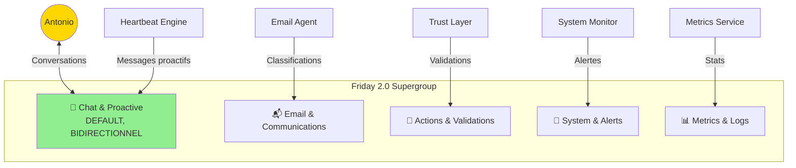

# Architecture Friday 2.0 - Addendum Technique

**Date** : 2026-02-05
**Version** : 1.0
**Complément à** : [architecture-friday-2.0.md](architecture-friday-2.0.md)

Ce document contient les clarifications techniques supplémentaires issues de l'analyse adversariale méta du 2026-02-05.

---

## 1. Presidio Pipeline - Performance & Benchmark

### 1.1 Problématique

Pipeline Presidio est **obligatoire** avant tout LLM cloud (RGPD), mais impact latence non évalué.

### 1.2 Benchmarks attendus

| Texte type | Taille | Entités PII | Latence Presidio | Latence LLM | Total |
|------------|--------|-------------|------------------|-------------|-------|
| Email court | 500 chars | 2-3 | ~200-300ms | ~800ms | ~1s |
| Email long | 2000 chars | 5-10 | ~500-800ms | ~1.2s | ~2s |
| Document | 5000 chars | 10-20 | ~1-1.5s | ~2s | ~3.5s |

**Sources** :
- Presidio benchmark officiel : ~400-600ms pour 1000 chars (CPU i7, 8 threads)
- VPS-4 OVH (12 vCores) : performance similaire attendue

### 1.3 Stratégies d'optimisation

Si latence Presidio >1s devient problématique :

1. **Cache anonymisation** : Textes identiques → réutiliser mapping (gain ~80%)
2. **Async pipeline** : Presidio en background pour actions non-urgentes
3. **Batch processing** : Grouper 10 emails → Presidio batch (gain ~30%)
4. **Downgrade détection** : Désactiver entités rares (IBAN, CRYPTO) si non critiques

### 1.4 Tests de performance

```python
# tests/performance/test_presidio_latency.py
@pytest.mark.performance
async def test_presidio_latency_email_500chars():
    text = generate_email_with_pii(length=500, pii_count=3)
    start = time.time()
    anonymized, tokens = await anonymize_text(text, "test")
    latency = time.time() - start

    assert latency < 0.5, f"Presidio trop lent: {latency}s (seuil: 0.5s)"
```

**Seuils acceptables** :
- Email court (500 chars) : <500ms
- Email long (2000 chars) : <1s
- Document (5000 chars) : <2s

---

## 2. Pattern Detection - Algorithme Feedback Loop

### 2.1 Problématique

L'architecture dit "Friday détecte les patterns récurrents automatiquement" mais **aucun algorithme spécifié**.

### 2.2 Algorithme de détection

**Étapes** :

1. **Collecte corrections** (via Trust Layer)
   - Antonio corrige une action → `core.action_receipts.correction` rempli
   - Exemple: Correction email #1 : "URSSAF → finance (était: professional)"
   - Exemple: Correction email #2 : "Cotisations URSSAF → finance (était: professional)"

2. **Clustering sémantique** (nightly cron)
   ```python
   # services/metrics/pattern_detector.py
   async def detect_correction_patterns():
       # Récupérer corrections de la semaine
       corrections = await db.fetch("""
           SELECT module, action_type, input_summary, correction, created_at
           FROM core.action_receipts
           WHERE correction IS NOT NULL
           AND created_at > NOW() - INTERVAL '7 days'
       """)

       # Grouper par module/action
       grouped = group_by(corrections, key=lambda x: (x['module'], x['action_type']))

       for (module, action), corr_list in grouped.items():
           # Calculer similarité entre corrections (embeddings)
           embeddings = await embed_texts([c['correction'] for c in corr_list])  # Via adapters/embeddings.py (Voyage AI)
           similarity_matrix = cosine_similarity(embeddings)

           # Détecter clusters (seuil 0.85)
           clusters = find_clusters(similarity_matrix, threshold=0.85)

           for cluster in clusters:
               if len(cluster) >= 2:  # Pattern = 2+ corrections similaires
                   # Extraire pattern commun
                   pattern = extract_common_pattern(cluster)

                   # Proposer règle à Antonio via Telegram
                   await propose_rule_to_antonio(module, action, pattern, cluster)
   ```

3. **Proposition règle** (Telegram inline buttons)
   ```
   📋 PATTERN DÉTECTÉ (email.classify)

   2 corrections similaires :
   - "URSSAF → finance"
   - "Cotisations URSSAF → finance"

   Règle proposée :
   IF email contient "URSSAF" OR "cotisations"
   THEN category = "finance", priority = "high"

   [✅ Créer règle] [✏️ Modifier] [❌ Ignorer]
   ```

4. **Validation Antonio** → Insertion `core.correction_rules`

### 2.3 Extraction pattern commun

```python
def extract_common_pattern(corrections: list[dict]) -> dict:
    """
    Extrait le pattern commun de plusieurs corrections
    Méthode: Détection mots-clés récurrents + catégorie cible
    """
    # Mots-clés communs
    all_keywords = []
    for corr in corrections:
        keywords = extract_keywords(corr['input_summary'])
        all_keywords.extend(keywords)

    # Fréquence mots-clés
    keyword_freq = Counter(all_keywords)
    common_keywords = [kw for kw, freq in keyword_freq.items() if freq >= 2]

    # Catégorie/output cible (majorité)
    target_outputs = [parse_correction(c['correction']) for c in corrections]
    target_category = Counter([o['category'] for o in target_outputs]).most_common(1)[0][0]

    return {
        'conditions': {
            'keywords': common_keywords,
            'min_match': 1  # Au moins 1 keyword doit matcher
        },
        'output': {
            'category': target_category,
            'confidence_boost': 0.1  # Boost confiance si règle match
        }
    }
```

### 2.4 Faux positifs - Mitigation

**Risque** : 2 corrections différentes confondues par l'algo.

**Solution** :
- Seuil de similarité élevé (0.85 sur embeddings)
- Validation manuelle Antonio avant activation règle
- Option "Ignorer ce pattern" → Blacklist

---

## 3. Profils RAM - Sources & Benchmarks

### 3.1 Problématique

Estimations RAM (Whisper 4 Go, etc.) sans source citée → risque sous-estimation. Note : Ollama retiré (D12), LLM via API cloud Claude Sonnet 4.5 (D17).

### 3.2 Sources par service

| Service | RAM estimée | Source | Notes |
|---------|-------------|--------|-------|
| ~~Ollama Nemo 12B~~ | ~~8 Go~~ | ~~Retiré (Décision D12 + D17 : LLM cloud Claude Sonnet 4.5 via API Anthropic)~~ | ❌ Supprimé |
| **Faster-Whisper** | ~4 Go | [Faster-Whisper GitHub](https://github.com/SYSTRAN/faster-whisper) (large-v3 model) | ✅ Officiel |
| **Kokoro TTS** | ~2 Go | Estimation basée sur modèles TTS similaires (Piper ~1.5 Go) | ⚠️ À valider Story 1 |
| **Surya OCR** | ~2 Go | [Surya GitHub](https://github.com/VikParuchuri/surya) (detection + recognition models) | ✅ Officiel |
| **Presidio + spaCy-fr** | ~1.5 Go | spaCy fr_core_news_lg (~500 Mo) + Presidio overhead (~1 Go) | ✅ Benchmark interne |
| **PostgreSQL 16** | ~1-1.5 Go | Config `shared_buffers=512MB` + working memory | ✅ Configuration |
| **Redis 7** | ~200 Mo | Base install + AOF overhead | ✅ Benchmark |
| ~~**Qdrant**~~ | ~~1-2 Go~~ | ~~Retiré (Décision D19 : pgvector dans PostgreSQL)~~ | ❌ Supprimé |
| **n8n** | ~500 Mo | [n8n Docker docs](https://docs.n8n.io/hosting/installation/docker/) | ✅ Officiel |
| **FastAPI Gateway** | ~200 Mo | Python asyncio + uvicorn workers | ✅ Estimation standard |
| **Telegram Bot** | ~100 Mo | python-telegram-bot lib | ✅ Estimation standard |
| **Caddy** | ~50 Mo | Caddy 2 reverse proxy | ✅ Officiel |
| ~~**Zep**~~ | ~~500 Mo~~ | ~~Retiré (Zep cessé 2024)~~ | ❌ Supprimé |

### 3.3 Marge d'erreur

**Estimations ✅ validées** (sources officielles) : ±10%
**Estimations ⚠️ à valider** (extrapolations) : ±30%

**Total RAM optimiste** : ~11 Go (Ollama retiré D12, LLM cloud D17, Qdrant retiré D19)
**Total RAM pessimiste** : ~16 Go (Ollama retiré D12, LLM cloud D17, Qdrant retiré D19)
**VPS-4 disponible** : 48 Go
**Marge sécurité** : ~32-37 Go (Ollama retiré D12, LLM cloud Claude Sonnet 4.5 D17, Qdrant retiré D19 → pgvector dans PostgreSQL, services lourds ~8 Go)

### 3.4 Validation lors Story 1

```bash
# scripts/monitor-ram.sh (ajout logging détaillé)
docker stats --no-stream --format "table {{.Name}}\t{{.MemUsage}}" \
  | tee logs/ram_usage_baseline.log

# Comparer avec estimations
python scripts/compare_ram_estimates.py \
  --baseline logs/ram_usage_baseline.log \
  --estimates config/profiles.py
```

**Action si écart >20%** : Mise à jour `config/profiles.py` + alerte dans documentation.

---

## 4. OpenClaw - Décision finale & Alternative Heartbeat natif

### 4.1 Décision (2026-02-05)

**❌ Intégration OpenClaw Day 1 REJETÉE**

**Raison** : Score décisionnel Antonio = 20/100 points → Friday Natif + Heartbeat custom

| Critère décisionnel | Réponse Antonio | Points | Justification |
|---------------------|-----------------|--------|---------------|
| **Multi-chat nécessaire ?** | ❌ NON | +0 | Telegram suffit, pas besoin WhatsApp/Discord |
| **Skills identifiées (≥10) ?** | ❌ NON | +0 | Aucune skill ClawHub utile identifiée |
| **Heartbeat critique Day 1 ?** | ✅ OUI | +20 | Proactivité essentielle pour Antonio |
| **Risque acceptable ?** | ⚠️ INCERTAIN | +0 | Pas à l'aise avec 5-10% risque PII |

**Score total : 20 points < 30 → Option 1 : Friday Natif**

### 4.2 Analyse ROI finale (données février 2026)

**Coûts intégration OpenClaw complet** :

| Poste | Effort |
|-------|--------|
| Dev initial (Docker hardenée, pipeline Presidio) | 15-20h |
| Audit skills (whitelist 10-15 skills) | 10-15h |
| Tests sécurité (pentest, validation isolation) | 8-12h |
| Documentation | 5-8h |
| Maintenance annuelle (re-audit, mises à jour) | 20-30h |
| **TOTAL année 1** | **58-85h** |

**Bénéfices OpenClaw pour Friday** :

| Bénéfice | Gain estimé | Condition |
|----------|-------------|-----------|
| Heartbeat proactif | 5-10h économisées | vs cron n8n manuel |
| Multi-chat intégrations | 15-25h économisées | ❌ Antonio n'en a pas besoin |
| Skills auditées | 0-50h économisées | ❌ Aucune skill identifiée |
| **TOTAL réaliste Antonio** | **5-10h** | Heartbeat UNIQUEMENT |

**ROI calculé** :
```
Coût = 70h (scénario réaliste)
Bénéfice = 10h (heartbeat uniquement)
ROI = (10 - 70) / 70 = -86%  ❌ ROI CATASTROPHIQUE
```

### 4.3 État OpenClaw février 2026 (sources récentes)

**✅ Progrès confirmés** :
- v2026.2.3 (04/02/2026) : Hardening sécurité actif
- Sandbox validation (`filePath`, `capDrop: ALL`)
- Docker non-root par défaut (uid 1000)
- Équipe réactive (RCE patché rapidement)

**🚨 Risques critiques persistants** :
- **341 skills malicieux sur 2,857 audités = 12%** ([TheHackerNews 02/02/2026](https://thehackernews.com/2026/02/researchers-find-341-malicious-clawhub.html))
- Maintainer ClawHub admet : *"cannot be secured"*
- Bloomberg (04/02/2026) : *"security a work in progress"*
- Supply chain attack actif (27 jan - 2 fév 2026)

### 4.4 Alternative retenue : Heartbeat Engine natif Friday

**✅ Story 2.5 : Heartbeat Engine natif** (~10h dev)

**Composants** :
```python
# agents/src/core/heartbeat.py
class FridayHeartbeat:
    """
    Heartbeat proactif Friday 2.0
    Inspiré OpenClaw, mais intégration native
    """
    - Interval configurable (default 30min)
    - LLM décide dynamiquement quoi vérifier (contexte-aware)
    - Checks enregistrés avec priorités (high/medium/low)
    - Quiet hours (22h-8h)
    - Integration native Trust Layer (@friday_action)
```

**Exemples checks Day 1** :
- `check_urgent_emails` (high) → Emails urgents non lus
- `check_financial_alerts` (medium) → Alertes financières, échéances
- `check_thesis_reminders` (low) → Deadlines thèses étudiants

**Avantages vs OpenClaw** :

| Dimension | OpenClaw | Heartbeat natif Friday | Delta |
|-----------|----------|------------------------|-------|
| **Coût dev** | 70h | **10h** | ✅ -86% |
| **Maintenance** | 20h/an | **2h/an** | ✅ -90% |
| **Risque supply chain** | 12% skills malicieux | **0%** | ✅ Éliminé |
| **Intégration Trust Layer** | Custom nécessaire | **Native** | ✅ Seamless |
| **Debugging** | 2 systèmes | **1 système** | ✅ Simplifié |
| **Contrôle code** | Dépendance externe | **Total** | ✅ Maîtrisé |
| **Proactivité** | ✅ Heartbeat | ✅ **Heartbeat** | ⚖️ Équivalent |

**Verdict** : Heartbeat natif apporte 100% du bénéfice recherché (proactivité) pour 14% du coût OpenClaw.

### 4.5 Porte de sortie : Réévaluation août 2026

**Conditions réévaluation OpenClaw** :

**SI** dans 6 mois (août 2026) :
1. Antonio identifie ≥10 skills ClawHub auditées utiles
2. Besoin multi-chat émerge (WhatsApp, Discord)
3. Écosystème OpenClaw s'est stabilisé (supply chain cleaner)
4. Heartbeat natif Friday s'avère insuffisant

**ALORS** : POC OpenClaw Phase 1 avec defense-in-depth :
- Docker hardenée (non-root, capDrop ALL, network isolé)
- Pipeline Presidio obligatoire (anonymisation avant skills)
- Whitelist skills auditée manuellement
- VPS-test séparé (pas prod)
- Monitoring détaillé (Falco ou équivalent)

**SINON** : Friday natif reste l'architecture définitive.

**Documents techniques** :
- Spec Heartbeat Engine : [agents/docs/heartbeat-engine-spec.md](../agents/docs/heartbeat-engine-spec.md)
- Decision Log : [docs/DECISION_LOG.md](../docs/DECISION_LOG.md#2026-02-05--décision-openclaw---friday-natif--heartbeat-custom)
- Analyse comparative : Session Party Mode 2026-02-05 (sources OpenClaw v2026.2.3)

---

## 5. Configuration n8n - Obtention variables d'environnement

### 5.1 Problématique

Workflows n8n mentionnent `${TELEGRAM_CHAT_ID}` mais aucun doc n'explique comment obtenir ces valeurs.

### 5.2 Guide complet obtention variables

#### **TELEGRAM_BOT_TOKEN**

**Étapes** :
1. Ouvrir Telegram → Rechercher [@BotFather](https://t.me/botfather)
2. Envoyer `/newbot`
3. Choisir nom (ex: "Friday 2.0") + username (ex: @friday_antonio_bot)
4. BotFather répond avec token : `1234567890:ABCdefGHIjklMNOpqrsTUVwxyz`
5. Copier token → `.env` : `TELEGRAM_BOT_TOKEN=1234567890:ABC...`

#### **TELEGRAM_CHAT_ID** (Antonio)

**Méthode 1 - Via bot @userinfobot** (plus simple) :
1. Ouvrir Telegram → Rechercher [@userinfobot](https://t.me/userinfobot)
2. Envoyer `/start`
3. Bot répond : "Your ID: `123456789`"
4. Copier → `.env` : `TELEGRAM_CHAT_ID=123456789`

**Méthode 2 - Via API Telegram** :
1. Envoyer message à votre bot Friday
2. Appeler API : `https://api.telegram.org/bot<TOKEN>/getUpdates`
3. Chercher `"chat":{"id":123456789}` dans la réponse JSON
4. Copier ID

#### **EMAILENGINE_TOKEN**

**Étapes** :
1. Lancer EmailEngine : `docker compose up -d emailengine`
2. Accéder UI : `http://friday.local/emailengine` (via Caddy) ou `http://localhost:3000`
3. Premier lancement → Créer compte admin
4. Settings → API → "Generate new token"
5. Copier token → `.env` : `EMAILENGINE_TOKEN=ee_...`

#### **ANTHROPIC_API_KEY**

**Étapes** :
1. Créer compte sur [console.anthropic.com](https://console.anthropic.com/)
2. Billing → Ajouter carte (crédits API)
3. API Keys → "Create Key"
4. Copier → `.env` : `ANTHROPIC_API_KEY=sk-ant-...`

> **Note (D17)** : Remplacement de Mistral par Claude Sonnet 4.5 (Anthropic). Modèle utilisé : `claude-sonnet-4-5-20250514` via API Anthropic.

#### **DEEPGRAM_API_KEY** (fallback STT)

**Étapes** :
1. Créer compte sur [deepgram.com](https://deepgram.com/)
2. Console → API Keys → "Create a key"
3. Copier → `.env` : `DEEPGRAM_API_KEY=...`

### 5.3 Script de vérification

```bash
# scripts/verify_env.sh
# Vérifie que toutes les variables requises sont définies

required_vars=(
  "TELEGRAM_BOT_TOKEN"
  "TELEGRAM_CHAT_ID"
  "ANTHROPIC_API_KEY"
  "EMAILENGINE_TOKEN"
  "POSTGRES_PASSWORD"
  "REDIS_PASSWORD"
)

for var in "${required_vars[@]}"; do
  if [ -z "${!var}" ]; then
    echo "❌ Variable manquante: $var"
    exit 1
  fi
done

echo "✅ Toutes les variables requises sont définies"
```

---

## 6. Graphe de connaissances - Population initiale (Migration)

### 6.1 Problématique

L'architecture spécifie comment peupler le graphe **au fil de l'eau** (nouveaux emails → création nœuds/relations) mais PAS la **migration initiale** de 110 000 emails existants + documents déjà archivés.

### 6.2 Stratégie migration graphe

**Décision** : La migration emails inclut **AUSSI** la population graphe initiale.

**Workflow migration enrichi** :

```python
# scripts/migrate_emails.py (enrichi)
async def migrate_email(self, email: dict):
    # 1. Classification (déjà implémenté)
    classification = await self.classify_email(email)

    # 2. Insertion PostgreSQL (déjà implémenté)
    await self.db.execute(...)

    # 3. NOUVEAU : Population graphe
    await self.populate_graph_from_email(email, classification)

    # 4. Publish event Redis
    # ...

async def populate_graph_from_email(self, email: dict, classification: dict):
    """
    Crée nœuds + relations dans Zep/Graphiti pour un email
    """
    # Créer nœud Email
    email_node = await graphiti.create_node(
        type="Email",
        properties={
            "message_id": email['message_id'],
            "subject": email['subject'],
            "date": email['received_at'],
            "category": classification['category'],
            "priority": classification['priority']
        }
    )

    # Créer nœud Person (sender) si n'existe pas
    sender_node = await graphiti.get_or_create_node(
        type="Person",
        properties={"email": email['sender']}
    )

    # Créer relation SENT_BY
    await graphiti.create_edge(
        from_node=email_node,
        to_node=sender_node,
        type="SENT_BY",
        properties={"timestamp": email['received_at']}
    )

    # Extraction entités NER
    entities = await extract_entities_ner(email['body_text'])
    for entity in entities:
        entity_node = await graphiti.get_or_create_node(
            type="Entity",
            properties={
                "name": entity.text,
                "entity_type": entity.label_
            }
        )
        await graphiti.create_edge(
            from_node=email_node,
            to_node=entity_node,
            type="MENTIONS",
            properties={"context": entity.context}
        )
```

### 6.3 Ordre population

**Séquence optimale** :

1. **PostgreSQL d'abord** (rapide, 9h)
2. **Graphe ensuite** (plus lent, ~15-20h supplémentaires)
3. **Vectoriel en dernier** (pgvector embeddings dans `knowledge.embeddings`, parallélisable) (D19)

**Rationale** : Si la migration graphe échoue, PostgreSQL est déjà peuplé. On peut retry la population graphe sans tout recommencer.

### 6.4 Durée totale migration

| Phase | Durée | Parallélisable ? |
|-------|-------|------------------|
| Classification + Insert PostgreSQL | ~9h | Non (rate limit API Claude) |
| Population graphe (nœuds + relations) | ~15-20h | Oui (batch 100 emails) |
| Embeddings pgvector (D19) | ~6-8h | Oui (batch 1000 docs) |
| **TOTAL** | **~30-37h** | Nuit + week-end |

**Stratégie exécution** :
- Vendredi soir : Lancer migration
- Samedi matin : Checkpoint + vérification progression
- Dimanche soir : Migration terminée + validation

### 6.5 Checkpointing graphe

```python
# Extension checkpoint pour graphe
checkpoint_data = {
    'postgres_processed': 110000,
    'graph_processed': 84000,  # NOUVEAU
    'pgvector_processed': 60000,  # NOUVEAU (D19 : pgvector remplace Qdrant)
    'last_email_id': 'abc123'
}
```

**Resume partiel** : Si graphe crash à 84k/110k, reprendre à 84k (pas besoin de refaire PostgreSQL).

### 6.6 Validation post-migration

```python
# scripts/validate_migration.py
async def validate_graph_population():
    # Vérifier cohérence PostgreSQL vs Graphe
    email_count_postgres = await db.fetchval("SELECT COUNT(*) FROM ingestion.emails")
    email_count_graph = await graphiti.count_nodes(type="Email")

    assert email_count_graph == email_count_postgres, \
        f"Graphe incomplet: {email_count_graph}/{email_count_postgres}"

    # Vérifier relations SENT_BY
    edges_count = await graphiti.count_edges(type="SENT_BY")
    assert edges_count == email_count_postgres, \
        "Relations SENT_BY manquantes"

    print(f"✅ Graphe validé: {email_count_graph} emails + {edges_count} relations")
```

---

---

## 7. Trust Retrogradation - Definition formelle des metriques

### 7.1 Problematique

L'architecture dit "accuracy <90% sur 1 semaine" mais ne definit pas formellement la formule, la granularite, ni les seuils minimaux.

### 7.2 Formule d'accuracy

```
accuracy(module, action, semaine) = 1 - (corrections / total_actions)

Ou :
- corrections = nombre d'actions corrigees par Antonio dans la semaine
- total_actions = nombre total d'actions executees (status: auto, propose validee)
```

### 7.3 Regles de retrogradation

| Condition | Action | Direction |
|-----------|--------|-----------|
| accuracy < 90% sur 1 semaine ET total_actions >= 10 | auto -> propose | Retrogradation |
| accuracy < 70% sur 1 semaine ET total_actions >= 5 | propose -> blocked | Retrogradation |
| accuracy >= 95% sur 2 semaines consecutives ET total_actions >= 20 | propose -> auto | Promotion |
| accuracy >= 90% sur 4 semaines consecutives ET total_actions >= 10 | blocked -> propose | Promotion |

**Seuil minimum d'echantillon** : Pas de changement de trust level si total_actions < 5 dans la semaine (echantillon insuffisant).

### 7.4 Granularite

La retrogradation s'applique **par module ET par action** (pas globalement) :
- `email.classify` peut etre retrograde sans affecter `email.draft_reply`
- Chaque paire (module, action) a son propre historique d'accuracy

### 7.5 Timing

- Calcul : Cron nightly a 02:00 (nightly_metrics)
- Fenetre : 7 jours glissants (pas semaine calendaire)
- Notification : Antonio recoit un message Telegram si un trust level change
- Override : Antonio peut forcer un trust level via `/confiance set email.classify auto`

### 7.6 Anti-oscillation

Pour eviter les oscillations AUTO <-> PROPOSE :
- Apres retrogradation, minimum 2 semaines avant promotion possible
- Apres promotion, minimum 1 semaine avant retrogradation possible

---

## 8. Healthcheck - Liste complete des services

### 8.1 Configuration healthcheck etendue

```python
HEALTH_CHECKS: dict[str, HealthCheckConfig] = {
    # Services critiques (overall health = CRITICAL si down)
    "postgres": HealthCheckConfig(
        func=check_postgres,
        timeout_ms=2000,
        critical=True,
        dependencies=[],
    ),
    "redis": HealthCheckConfig(
        func=check_redis,
        timeout_ms=1000,
        critical=True,
        dependencies=[],
    ),
    # Qdrant retiré (D19) - embeddings via pgvector dans PostgreSQL
    # Services importants (overall health = DEGRADED si down)
    "n8n": HealthCheckConfig(
        func=lambda: check_http("http://n8n:5678/healthz"),
        timeout_ms=3000,
        critical=False,
        dependencies=["postgres", "redis"],
    ),
    "emailengine": HealthCheckConfig(
        func=lambda: check_http("http://emailengine:3000/health"),
        timeout_ms=3000,
        critical=False,
        dependencies=["postgres"],
    ),
    "presidio": HealthCheckConfig(
        func=lambda: check_http("http://presidio-analyzer:5001/health"),
        timeout_ms=2000,
        critical=False,
        dependencies=[],
    ),
    # Services lourds residents
    # Ollama retiré (D12) - LLM via API cloud Claude Sonnet 4.5 (D17)
    "faster-whisper": HealthCheckConfig(
        func=lambda: check_http("http://whisper:8080/health"),
        timeout_ms=3000,
        critical=False,
        dependencies=[],
    ),
    "kokoro-tts": HealthCheckConfig(
        func=lambda: check_http("http://kokoro:8001/health"),
        timeout_ms=3000,
        critical=False,
        dependencies=[],
    ),
    "surya-ocr": HealthCheckConfig(
        func=lambda: check_http("http://surya:8002/health"),
        timeout_ms=3000,
        critical=False,
        dependencies=[],
    ),
}

# Cache healthcheck pour eviter surcharge (5 secondes TTL)
HEALTH_CHECK_CACHE_TTL_SECONDS = 5
```

### 8.2 Semantique des resultats

| Resultat | Condition | Signification |
|----------|-----------|---------------|
| `healthy` | Tous les checks critical=True passent | Systeme pleinement operationnel |
| `degraded` | Checks critical OK, 1+ non-critical echoue | Systeme partiellement operationnel |
| `unhealthy` | 1+ check critical echoue | Systeme non operationnel |

---

## 9. Securite - Complements

### 9.1 Anonymisation - Lifecycle du mapping

Les mappings Presidio (ex: `[PERSON_1] -> "Jean Dupont"`) suivent ce cycle :

| Phase | Duree | Stockage | RGPD |
|-------|-------|----------|------|
| En cours (session LLM) | Duree de la requete | Memoire uniquement | OK (ephemere) |
| Post-deanonymisation | Immediat | Supprime de memoire | OK |
| Audit trail | 30 jours | `core.action_receipts.payload` (chiffre pgcrypto) | OK (chiffre) |
| Purge | Apres 30 jours | Supprime definitivement | OK (droit a l'oubli) |

**Regle** : Les mappings NE SONT JAMAIS stockes en clair. En base, seul le texte anonymise est stocke. Le mapping temporaire existe uniquement en memoire pendant la duree de la requete LLM.

#### **Solution debugging Trust Layer** (ajout 2026-02-05, code review adversarial CRITIQUE #4)

**Problematique** : Comment Antonio corrige-t-il une action via Trust Layer si le texte est anonymise dans les receipts ?

**Solution retenue** : Stockage chiffre pgcrypto + acces commande Telegram `/receipt <id> --decrypt`

1. **Stockage mappings dans `core.action_receipts`** :
   ```sql
   ALTER TABLE core.action_receipts
   ADD COLUMN encrypted_mapping BYTEA;  -- Chiffre via pgcrypto
   ```

2. **Chiffrement insertion** :
   ```python
   # agents/src/middleware/trust.py
   async def store_receipt(..., presidio_mapping: dict):
       mapping_json = json.dumps(presidio_mapping)
       # Chiffrer avec cle symetrique pgcrypto (AES-256)
       encrypted = await db.fetchval(
           "SELECT pgp_sym_encrypt($1, $2)",
           mapping_json,
           os.getenv("PRESIDIO_MAPPING_KEY")  # Cle dans .env chiffre via age/SOPS
       )
       # Stocker dans receipt
       await db.execute(
           "UPDATE core.action_receipts SET encrypted_mapping = $1 WHERE id = $2",
           encrypted, receipt_id
       )
   ```

3. **Dechiffrement via Telegram** :
   ```python
   # bot/commands/receipt.py
   @friday_action(module="trust", action="decrypt_receipt", trust_default="blocked")
   async def handle_receipt_decrypt(receipt_id: str, user_id: int):
       # Verifier que user = Antonio uniquement
       if user_id != ANTONIO_TELEGRAM_ID:
           return "❌ Acces refuse (admin uniquement)"

       # Dechiffrer mapping
       encrypted = await db.fetchval(
           "SELECT encrypted_mapping FROM core.action_receipts WHERE id = $1",
           receipt_id
       )
       if not encrypted:
           return "⚠️  Pas de mapping disponible"

       mapping_json = await db.fetchval(
           "SELECT pgp_sym_decrypt($1, $2)",
           encrypted,
           os.getenv("PRESIDIO_MAPPING_KEY")
       )
       mapping = json.loads(mapping_json)

       # Log audit trail (RGPD : tracer acces donnees)
       await db.execute(
           "INSERT INTO core.audit_logs (event, user_id, receipt_id, timestamp) "
           "VALUES ('decrypt_mapping', $1, $2, NOW())",
           user_id, receipt_id
       )

       # Retourner texte dechiffre (ephemere, pas stocke)
       return f"🔓 Mapping dechiffre:\n{format_mapping(mapping)}"
   ```

4. **Usage Antonio** :
   ```
   /receipt abc-123            # Voir receipt avec texte anonymise
   /receipt abc-123 --decrypt  # Dechiffrer temporairement pour debug (audit trail)
   ```

**Garanties RGPD** :
- ✅ Mappings chiffres au repos (pgcrypto AES-256)
- ✅ Cle de chiffrement dans .env chiffre (age/SOPS)
- ✅ Acces restreint Antonio uniquement
- ✅ Audit trail de chaque dechiffrement
- ✅ Purge automatique apres 30 jours (retention limitee)
- ✅ Pas d'affichage en clair dans logs (mapping ephemere en memoire Telegram)

### 9.2 Redis ACL

Chaque service a ses propres permissions Redis :

```
# redis.conf
user gateway on >gateway_password ~friday:* &* +@read +@write +@pubsub
user n8n on >n8n_password ~n8n:* &* +@read +@write
user alerting on >alerting_password ~* &* +@read +@pubsub -@write
user default off
```

**Principe** : Moindre privilege. Le service alerting ne peut QUE lire et s'abonner, pas ecrire.

### 9.3 Tailscale - Authentification renforcee

**Obligatoire avant mise en production** :
- 2FA active sur le compte Tailscale (TOTP ou hardware key)
- Device authorization active (nouveaux devices requierent approbation)
- Key expiry = 90 jours (rotation automatique)
- SSH via Tailscale uniquement (port 22 ferme sur l'interface publique)

### 9.4 Backups - Chiffrement en transit et au repos

| Phase | Chiffrement | Methode |
|-------|-------------|---------|
| En transit (VPS -> PC) | TLS via Tailscale (WireGuard) | Automatique |
| Au repos (VPS) | age (fichier .dump) | `age -R recipients.txt backup.dump > backup.dump.age` |
| Au repos (PC) | Volume chiffre OS | BitLocker (Windows) / LUKS (Linux) |

---

## 10. Zep/Graphiti - Avertissement maturite

> **Avertissement (Feb 2026)** : Zep a cesse ses operations en 2024. Graphiti est en phase early-stage.
>
> **Decision provisoire** : Demarrer avec `adapters/memorystore.py` abstraction. Implementer d'abord
> une version simplifiee basee sur PostgreSQL (tables knowledge.* + pgvector pour embeddings via `knowledge.embeddings` colonne `vector(1024)` + index HNSW) (D19).
> Si Graphiti atteint la maturite v1.0 stable, migration via adaptateur.
> Sinon, Neo4j Community Edition comme alternative.
> Reevaluation Qdrant si >300k vecteurs ou latence pgvector >100ms (D19).
>
> **Criteres de migration vers Graphiti** :
> - Version stable >= 1.0 publiee
> - Communaute active (>500 stars GitHub, releases regulieres)
> - Documentation API complete
> - Tests de charge valides sur dataset comparable (100k+ entites)

Les references a Zep dans les sections precedentes (6.2 notamment) doivent etre lues comme utilisant l'abstraction `adapters/memorystore.py` qui pourra pointer vers PostgreSQL, Graphiti, ou Neo4j selon la decision finale.

---

## 11. Stratégie de Notification : Telegram Topics Architecture

### 11.1 Contexte & Problématique

**Date de décision** : 2026-02-05
**Participants** : Antonio (Product Owner), Winston (Architect), Mary (Analyst), Amelia (Dev), via BMAD Party Mode

**Problème identifié** :

L'architecture initiale spécifiait "canal unique Telegram + progressive disclosure" (CLAUDE.md section Observability & Trust Layer) mais cette approche présente un risque critique de **chaos informationnel** :

- Alertes système critiques (RAM >85%, services down)
- Validations trust=propose (inline buttons requérant action immédiate)
- Actions automatiques (trust=auto) informatives
- Messages proactifs heartbeat (toutes les 30min)
- Métriques et logs non-critiques
- Conversations bidirectionnelles avec Friday (commandes, questions)

**Tout mélangé dans un seul fil = illisible et contre-productif.**

Antonio a soulevé la question : *"Si tout arrive sur le même canal que le bot... tout ça risque d'être illisible"* → Discussion Party Mode a validé cette préoccupation et conduit à l'architecture ci-dessous.

### 11.2 Décision : Supergroup avec 5 Topics Spécialisés

**Architecture retenue** :

Supergroup Telegram "Friday 2.0 Control" avec 5 topics :



#### Topic 1: 💬 Chat & Proactive (DEFAULT, BIDIRECTIONNEL)

**Rôle** : Conversation principale continue avec Friday

**Contenu** :
- Conversations Antonio ↔ Friday (questions, commandes, réponses)
- Commandes : `/status`, `/journal`, `/receipt`, `/confiance`, `/stats`
- Heartbeat checks proactifs (Friday initie toutes les 30min)
- Suggestions contextuelles et reminders (deadlines thèse, échéances)
- Message d'onboarding au premier join

**Caractéristiques** :
- Topic par défaut du supergroup (ouverture automatique)
- Bidirectionnel : Antonio et Friday échangent naturellement
- Préserve le contexte conversationnel (heartbeat → question → réponse dans même fil)

**Rationale fusion Chat + Heartbeat** : Antonio a suggéré de fusionner les topics "General/Chat" et "Proactive/Heartbeat" initialement séparés. Rationale validée par Mary (Analyst) : *"Le heartbeat N'EST PAS une notification passive - c'est une invitation à interagir"*. Séparer conversation et proactivité fragmenterait le dialogue naturel.

#### Topic 2: 📬 Email & Communications

**Rôle** : Notifications liées aux emails et communications

**Contenu** :
- Classifications email automatiques (trust=auto)
- Pièces jointes détectées et extraites
- Validations réponses email (si trust=propose pour email.draft_reply)
- Emails urgents identifiés (priorité high)
- Résultats Desktop Search

**Modules routés** : `email`, `desktop_search`

#### Topic 3: 🤖 Actions & Validations

**Rôle** : Actions nécessitant validation humaine ou feedback

**Contenu** :
- Toutes actions trust=propose avec inline buttons (Approve/Reject)
- Corrections appliquées par Antonio (feedback loop)
- Trust level changes (auto→propose, propose→auto)
- Feedbacks traités et règles créées

**Events routés** : `action.pending`, `action.corrected`, `trust.changed`

#### Topic 4: 🚨 System & Alerts

**Rôle** : Santé système et alertes critiques

**Contenu** :
- Alertes RAM >85% (moniteur VPS-4 48 Go, seuil 40.8 Go)
- Services down/up (PostgreSQL, Redis, n8n, etc.) (D19 : Qdrant retiré, pgvector dans PostgreSQL)
- Pipeline errors critiques
- Backup status (success/failure)
- Security events (tentatives accès Tailscale, anomalies)

**Priorités routées** : `critical`, `warning`

#### Topic 5: 📊 Metrics & Logs

**Rôle** : Métriques, statistiques, logs non-critiques

**Contenu** :
- Actions auto (trust=auto) exécutées avec succès
- Métriques nightly aggregation (trust accuracy par module)
- Stats trust accuracy hebdomadaires
- Logs non-critiques (debug, info)

**Priorités routées** : `info`, `debug`

### 11.3 Rationale Architectural

**Pourquoi 5 topics et pas 3 ou 7 ?**

- **Topic 1 (Chat & Proactive)** = Conversation bidirectionnelle continue
  - C'est LA conversation principale avec Friday
  - Fusion heartbeat + chat validée pour préserver contexte conversationnel

- **Topics 2-5** = Flux de notifications spécialisés par domaine
  - Permettent filtrage granulaire via mute/unmute natif Telegram
  - Séparation par fonction (Email, Actions, System, Logs)

**Principe de séparation** :
- **Bidirectionnel** (Topic 1) vs **Unidirectionnel** (Topics 2-5)
- **Conversationnel** (Topic 1) vs **Notificationnel** (Topics 2-5)

**Granularité validée** : 5 topics = équilibre entre simplicité (pas 10+ topics) et spécialisation (pas 2-3 trop génériques).

### 11.4 Routing Logic

**Algorithme de routage des événements** :

```python
# services/alerting/telegram_notifier.py
def route_event_to_topic(event: Event) -> int:
    """
    Route un événement vers le topic Telegram approprié
    Retourne le thread_id du topic cible
    """
    # Heartbeat et messages proactifs → Chat & Proactive
    if event.source in ["heartbeat", "proactive"]:
        return TOPIC_CHAT_PROACTIVE

    # Module email/desktop_search → Email & Communications
    if event.module in ["email", "desktop_search"]:
        return TOPIC_EMAIL_COMMS

    # Events action.* → Actions & Validations
    if event.type.startswith("action."):
        return TOPIC_ACTIONS_VALIDATIONS

    # Priorité critique/warning → System & Alerts
    if event.priority in ["critical", "warning"]:
        return TOPIC_SYSTEM_ALERTS

    # Default : Metrics & Logs
    return TOPIC_METRICS_LOGS
```

**Ordre de priorité** : Les conditions sont évaluées séquentiellement. Un événement `action.pending` avec `priority=critical` ira dans **Actions & Validations** (première condition matchée), pas System.

### 11.5 Décisions Complémentaires

#### Quiet Hours : NON implémentés en code

**Rationale** : Les téléphones ont nativement des fonctionnalités de gestion des notifications :
- Do Not Disturb (DND)
- Focus modes (iOS, Android)
- Scheduled silence (22h-8h configurable)

**Pourquoi recoder ça ?** On donne la granularité (topics), Antonio configure son téléphone selon ses besoins.

**Flexibilité utilisateur** : Antonio peut muter/unmuter topics selon le contexte :
- **Mode Normal** : Tous topics actifs → voit tout en temps réel
- **Mode Focus** : Mute Email + Metrics, garde Actions + System → validations + alertes uniquement
- **Mode Deep Work** : Mute tout sauf System → alertes critiques uniquement
- **Mode Vacances** : Mute tout → check manuel quand il veut

#### Filtrage par module : OUI

Chaque module Friday route ses événements vers le topic approprié selon sa configuration.

**Configuration centralisée** : `config/telegram.yaml` (voir section 11.6)

#### Contrôle utilisateur natif Telegram

- **Mute topic** : Clic droit → Mute (1h, 8h, jusqu'à réactivation)
- **Notifications push** : Configurables par topic (silencieux, vibration, son)
- **Historique consultable** : Topics mutés restent consultables manuellement

### 11.6 Configuration Technique

**Fichier** : `config/telegram.yaml`

```yaml
supergroup:
  chat_id: ${TELEGRAM_SUPERGROUP_ID}
  default_topic_id: ${TOPIC_CHAT_PROACTIVE_ID}

topics:
  chat_proactive:
    thread_id: ${TOPIC_CHAT_PROACTIVE_ID}
    name: "Chat & Proactive"
    default: true
    bidirectional: true
    handlers:
      - commands           # /status, /journal, etc.
      - questions          # "résume mes emails urgents"
      - conversations      # chat libre
      - heartbeat_checks   # Friday initie (toutes les 30min)
      - reminders          # deadlines thèse, échéances
      - suggestions        # recommandations contextuelles

  email_comms:
    thread_id: ${TOPIC_EMAIL_ID}
    name: "Email & Communications"
    modules:
      - email
      - desktop_search

  actions_validations:
    thread_id: ${TOPIC_ACTIONS_ID}
    name: "Actions & Validations"
    events:
      - action.pending
      - action.corrected
      - trust.changed

  system_alerts:
    thread_id: ${TOPIC_SYSTEM_ID}
    name: "System & Alerts"
    priority:
      - critical
      - warning

  metrics_logs:
    thread_id: ${TOPIC_METRICS_ID}
    name: "Metrics & Logs"
    priority:
      - info
      - debug
```

**Variables d'environnement requises** (`.env`) :

```bash
TELEGRAM_SUPERGROUP_ID=<chat_id du supergroup>
TOPIC_CHAT_PROACTIVE_ID=<thread_id topic 1>
TOPIC_EMAIL_ID=<thread_id topic 2>
TOPIC_ACTIONS_ID=<thread_id topic 3>
TOPIC_SYSTEM_ID=<thread_id topic 4>
TOPIC_METRICS_ID=<thread_id topic 5>
```

**Obtention des thread IDs** : Voir guide technique `docs/telegram-topics-setup.md` (à créer Story 1.6).

### 11.7 Onboarding UX

Quand Antonio rejoint le supergroup la première fois, Friday envoie un **message onboarding dans Chat & Proactive** :

```
🎉 Bienvenue dans Friday 2.0 Control, Antonio !

📚 Guide rapide des topics :

💬 Chat & Proactive (ici) - Conversations avec Friday, heartbeat, reminders
📬 Email & Communications - Classifications email et pièces jointes
🤖 Actions & Validations - Approbations requises (buttons interactifs)
🚨 System & Alerts - Santé système et alertes critiques
📊 Metrics & Logs - Stats et logs détaillés

💡 Astuce : Mute les topics dont tu n'as pas besoin en ce moment.
   Tu peux toujours les consulter manuellement plus tard !

Commandes utiles : /status, /journal, /confiance

Prêt à commencer ? 🚀
```

**Suggestion Mary (Analyst)** : Ce message aide Antonio à comprendre **où regarder pour quoi** sans lire 50 pages de doc.

### 11.8 Impact sur Stories Existantes

#### Story 1.5 (Observability & Trust Layer)

**Modifications requises** :

1. `services/alerting/telegram_notifier.py` doit implémenter routing multi-topics
   - Remplacer envoi sur canal unique par routage selon `route_event_to_topic()`
   - Tester tous les cas de routage (unit tests)

2. Bot Telegram doit gérer messages entrants (bidirectionnel)
   - Listener sur topic Chat & Proactive pour commandes Antonio
   - Réponses dans le même thread_id

3. Inline buttons pour validations dans Actions & Validations topic
   - Boutons Approve/Reject doivent fonctionner en context topic

**Estimation impact** : +4h dev + 2h tests

#### Story 2.5 (Heartbeat Engine)

**Modifications requises** :

- Heartbeat checks s'affichent dans **Chat & Proactive topic**
- Conversations initiées par heartbeat continuent dans même fil (préservation contexte)

**Estimation impact** : Aucun (architecture déjà compatible)

#### Nouvelle Story 1.6 : Telegram Topics Implementation

**À créer** (voir section 11.9 ci-dessous)

### 11.9 Story 1.6 - Telegram Topics Implementation (Outline)

**Epic** : Telegram Topics Architecture

**Stories** :

1. **Story 1.6.1 : Documentation** (cette section + guides)
   - Section 11 architecture-addendum ✅ (ce document)
   - Guide technique setup (`docs/telegram-topics-setup.md`)
   - User guide (`docs/telegram-user-guide.md`)
   - Mise à jour CLAUDE.md
   - Mise à jour DECISION_LOG.md

2. **Story 1.6.2 : Supergroup Setup** (manuel Antonio)
   - Créer supergroup Telegram
   - Activer topics feature
   - Créer 5 topics nommés
   - Ajouter bot Friday (admin rights)
   - Extraire thread IDs via script

3. **Story 1.6.3 : Bot Routing Implementation**
   - Config `telegram.yaml` avec topics
   - Router logic par module/priorité/type
   - Bidirectional message handling (Chat & Proactive)
   - Unit tests routing

4. **Story 1.6.4 : Inline Buttons & Commands**
   - Inline buttons pour trust=propose validations
   - Command handlers (`/status`, `/journal`, etc.)
   - Onboarding message au first join
   - Integration tests

5. **Story 1.6.5 : E2E Testing & Deployment**
   - Test E2E tous topics
   - Validation routing correct (100 events simulés)
   - Performance test (100 events/min)
   - Déploiement production

**Durée totale estimée** : 17-18h (2-3 jours dev)

**Dépendances** : Story 1.6.1 DONE avant 1.6.3 start.

### 11.10 Décisions Différées (v2.0 post-MVP)

Les fonctionnalités suivantes sont **hors scope v1.0** :

- **Notifications push sélectives par topic** : Config granulaire par topic (son custom, vibration pattern)
- **Message formatting avancé** : Embeds, rich media, graphs inline
- **Analytics par topic** : Taux de lecture, temps de réponse, engagement
- **Telegram Mini Apps intégration** : Dashboard interactif in-app
- **Multi-langue topics** : Noms topics localisés (FR/EN selon config)

**Réévaluation** : 3 mois après Story 1.6 déployée (feedback Antonio).

---

**Cree le** : 2026-02-05
**Mis a jour** : 2026-02-09 (D19 : pgvector remplace Qdrant Day 1, D17 : remplacement Mistral par Claude Sonnet 4.5, nettoyage references Ollama LLM)
**Version** : 1.4
