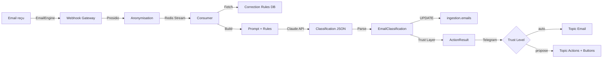

# Classification Email LLM - Documentation Technique

> **Story 2.2** - Classification automatique emails via Claude Sonnet 4.5

## Vue d'ensemble

Friday 2.0 classifie automatiquement les emails entrants en 8 catégories grâce à Claude Sonnet 4.5. Le système combine:

- **LLM classification** : Claude Sonnet 4.5 avec temperature 0.1 (déterministe)
- **Correction rules** : Injection de règles prioritaires dans le prompt (max 50)
- **Trust Layer** : Validation Mainteneur selon niveau de confiance
- **Cold start mode** : Calibrage initial sur 10-20 premiers emails
- **Feedback loop** : Pattern detection + proposition règles automatique

## Catégories disponibles

| Catégorie | Description | Emoji | Exemples expéditeurs |
|-----------|-------------|-------|---------------------|
| `medical` | Cabinet médical SELARL | 🏥 | CPAM, URSSAF santé, patients, planning |
| `finance` | Comptabilité, banques, impôts | 💰 | URSSAF, expert-comptable, banques (5 périmètres) |
| `faculty` | Enseignement universitaire | 🎓 | Faculté, étudiants, examens, scolarité |
| `research` | Recherche académique | 🔬 | Doctorants, publications, colloques, revues |
| `personnel` | Vie personnelle | 👤 | Amis, famille, achats, loisirs |
| `urgent` | Action immédiate requise | 🚨 | VIP, deadline <24h, urgence explicite |
| `spam` | Publicités commerciales | 🗑️ | Newsletters, promotions, solicitations |
| `unknown` | Inclassable | ❓ | Emails corrompus, ambigus, non pertinents |

## Architecture



## Workflow détaillé

### 1. Réception email (Story 2.1)

```python
# EmailEngine webhook → Gateway → Presidio → Redis Streams
{
  "id": "email-abc123",
  "from": "compta@urssaf.fr",
  "subject": "Cotisations SELARL Q4 2025",
  "body": "[ANONYMIZED]",
  "received_at": "2026-02-11T10:30:00Z"
}
```

### 2. Fetch correction rules

```sql
SELECT id, module, action_type, scope, priority, conditions, output
FROM core.correction_rules
WHERE module = 'email'
  AND (action_type = 'classify' OR action_type IS NULL)
  AND active = true
ORDER BY priority ASC
LIMIT 50
```

**Exemple règle** :

```json
{
  "id": "rule-001",
  "priority": 10,
  "conditions": {"from": "@urssaf.fr"},
  "output": {"category": "finance"},
  "scope": "classification"
}
```

### 3. Build classification prompt

```python
# agents/src/agents/email/prompts.py
system_prompt = f"""
Tu es un assistant de classification d'emails pour un médecin français multi-casquettes :
- Médecin libéral (SELARL)
- Enseignant universitaire (faculté de médecine)
- Directeur de thèses (doctorants)
- Investisseur immobilier (SCIs)

**RÈGLES DE CORRECTION PRIORITAIRES** :
{format_correction_rules(rules)}

**CATÉGORIES DISPONIBLES** :
- `medical` : ...
- `finance` : ...
...

**FORMAT DE SORTIE OBLIGATOIRE** :
{{
  "category": "medical",
  "confidence": 0.92,
  "reasoning": "...",
  "keywords": ["SELARL", "cotisations"],
  "suggested_priority": "high"
}}
"""

user_prompt = f"""
Classifie cet email dans l'une des catégories disponibles.

**EMAIL À CLASSIFIER** :
{anonymized_email_text}

Retourne UNIQUEMENT le JSON de classification (sans markdown).
"""
```

### 4. Appel Claude API

```python
# agents/src/agents/email/classifier.py
response = await llm_adapter.complete(
    system_prompt=system_prompt,
    user_prompt=user_prompt,
    temperature=0.1,      # Classification déterministe
    max_tokens=300,       # Catégorie + reasoning + keywords
)

# Parse JSON response
classification = EmailClassification.model_validate_json(response)
```

### 5. Update database

```sql
UPDATE ingestion.emails
SET category = 'medical',
    confidence = 0.92
WHERE id = 'email-abc123'
```

### 6. Trust Layer + Notification

```python
# @friday_action decorator crée ActionResult
result = ActionResult(
    input_summary="Email de compta@urssaf.fr: Cotisations SELARL Q4 2025",
    output_summary="→ finance (confidence=0.92)",
    confidence=0.92,
    reasoning="Expéditeur @urssaf.fr, mots-clés cotisations",
    payload={
        "category": "finance",
        "keywords": ["SELARL", "cotisations", "URSSAF"],
        "model": "claude-sonnet-4-5-20250929",
        "latency_ms": 5240,
    }
)

# Telegram notification selon trust level
if trust_level == "auto":
    # Topic Email (informatif)
    send_to_topic(TOPIC_EMAIL_ID, format_notification(result))
elif trust_level == "propose":
    # Topic Actions (validation requise)
    send_to_topic(TOPIC_ACTIONS_ID, format_notification_with_buttons(result))
```

## Cold Start Mode (AC6)

### Objectif

Calibrer le système sur les 10-20 premiers emails avant de passer en mode automatique.

### Fonctionnement

```sql
-- Table tracking
CREATE TABLE core.cold_start_tracking (
    module VARCHAR(50),
    action_type VARCHAR(100),
    phase VARCHAR(20) CHECK (phase IN ('cold_start', 'calibrated', 'production')),
    emails_processed INT DEFAULT 0,
    accuracy DOUBLE PRECISION,
    PRIMARY KEY (module, action_type)
);

-- Seed initial
INSERT INTO core.cold_start_tracking (module, action_type, phase)
VALUES ('email', 'classify', 'cold_start');
```

### Progression

| Phase | Conditions | Trust Level | Description |
|-------|-----------|-------------|-------------|
| `cold_start` | 0-9 emails | `propose` | Validation obligatoire TOUTES classifications |
| `calibrated` | 10-19 emails + accuracy < 90% | `propose` | Calibrage en cours |
| `production` | 10+ emails + accuracy >= 90% | `auto` | Classification automatique |

### Calcul accuracy

```python
async def _check_cold_start_progression(db_pool):
    # Incrémenter compteur
    await db.execute(
        "UPDATE core.cold_start_tracking "
        "SET emails_processed = emails_processed + 1 "
        "WHERE module = 'email' AND action_type = 'classify'"
    )

    # Si >= 10 emails → calculer accuracy
    if emails_processed >= 10:
        accuracy = await calculate_accuracy(module, action)

        if accuracy >= 0.90:
            # Promotion → production
            await db.execute(
                "UPDATE core.cold_start_tracking "
                "SET phase = 'production' "
                "WHERE module = 'email' AND action_type = 'classify'"
            )
        elif emails_processed >= 20:
            # Alerte Mainteneur (accuracy insuffisante après 20 emails)
            await send_alert_low_accuracy(module, action, accuracy)
```

## Correction Workflow (AC5)

### Interface Telegram

Lorsqu'une classification est erronée, le Mainteneur peut la corriger via Telegram :

**1. Cliquer [Correct] sur notification**

```
📧 Email classifié

De : compta@urssaf.fr
Sujet : Cotisations SELARL Q4 2025
Catégorie : 🏥 medical (92%)

📋 Reasoning : Expéditeur @urssaf.fr, mentions cotisations

#email #medical

[Approve] [Reject] [Correct]
```

**2. Sélectionner nouvelle catégorie**

```
📝 Correction classification email

Receipt : `abc12345`
Classification actuelle : → medical (0.92)

**Quelle est la bonne catégorie ?**

[🏥 Medical] [💰 Finance]
[🎓 Faculty] [🔬 Research]
[👤 Personnel] [🚨 Urgent]
[🗑️ Spam] [❓ Unknown]
```

**3. Confirmation**

```
✅ Correction enregistrée

Receipt : `abc12345`
Catégorie originale : medical
Nouvelle catégorie : 💰 finance

Friday apprendra de cette correction lors du pattern detection nightly.
```

### Backend

```python
# bot/handlers/corrections.py
async def handle_category_correction(update, context):
    # Parse callback: "correct_email_cat_finance_abc12345"
    new_category = parse_category(update.callback_query.data)
    receipt_id = parse_receipt_id(update.callback_query.data)

    # Load receipt & extract original category
    row = await db.fetchrow(
        "SELECT output_summary FROM core.action_receipts WHERE id = $1",
        receipt_id
    )
    original_category = extract_category(row["output_summary"])

    # Update receipt
    correction_json = json.dumps({
        "correct_category": new_category,
        "original_category": original_category,
    })

    await db.execute(
        "UPDATE core.action_receipts "
        "SET correction = $1, status = 'corrected' "
        "WHERE id = $2",
        correction_json, receipt_id
    )

    # Pattern detection nightly job utilisera cette correction
```

## Pattern Detection & Feedback Loop

### Détection automatique

Le job nightly `services/metrics/nightly.py` analyse les corrections :

```python
# Story 1.7 - Pattern Detection
async def detect_correction_patterns():
    # Chercher patterns (≥2 corrections identiques)
    patterns = await db.fetch("""
        SELECT
            correction->>'correct_category' as category,
            COUNT(*) as occurrences
        FROM core.action_receipts
        WHERE module = 'email'
          AND action_type = 'classify'
          AND status = 'corrected'
          AND created_at > NOW() - INTERVAL '7 days'
        GROUP BY correction->>'correct_category'
        HAVING COUNT(*) >= 2
    """)

    for pattern in patterns:
        # Analyser conditions communes
        conditions = extract_common_conditions(pattern)

        # Proposer règle au Mainteneur
        await propose_correction_rule(
            module='email',
            action='classify',
            conditions=conditions,
            output={'category': pattern['category']},
        )
```

### Exemple règle générée

```json
{
  "module": "email",
  "action_type": "classify",
  "priority": 50,
  "conditions": {
    "from": "@urssaf.fr",
    "keywords": ["cotisations", "SELARL"]
  },
  "output": {
    "category": "finance"
  },
  "scope": "classification",
  "source_receipts": ["receipt-001", "receipt-045"],
  "active": false  // Attend validation Mainteneur
}
```

## Performance & Métriques

### Latence cible (NFR1)

| Étape | Latence cible | Mesure |
|-------|--------------|--------|
| Fetch correction rules | < 100ms | SELECT limit 50 |
| Anonymisation Presidio | < 2s | Benchmark Story 1.5 |
| Appel Claude API | < 5s | Moyenne observée |
| Parse + UPDATE BDD | < 500ms | asyncpg |
| **TOTAL** | **< 8s** | Budget 10s AC7 |

### Métriques exposées

```python
# result.payload contient métriques
{
  "category": "finance",
  "confidence": 0.92,
  "keywords": ["SELARL", "cotisations"],
  "model": "claude-sonnet-4-5-20250929",
  "latency_ms": 5240,
  "rules_applied_count": 3,
}
```

### Dashboard Telegram

```bash
/stats

📊 **Statistiques Email Classification**

Total emails classifiés : 1 245
Accuracy globale : 91.2%
Accuracy 7 derniers jours : 93.5%

**Breakdown par catégorie** :
🏥 medical : 342 (92.4%)
💰 finance : 287 (94.1%)
🎓 faculty : 189 (89.7%)
🔬 research : 156 (91.0%)
👤 personnel : 134 (88.1%)
🚨 urgent : 45 (95.6%)
🗑️ spam : 78 (96.2%)
❓ unknown : 14 (71.4%)

**Latence moyenne** : 5.2s
**Cold start** : production (42 emails validés)
```

## Troubleshooting

### Classification erronée

**Symptôme** : Email médical classé en finance

**Diagnostic** :

```bash
# Vérifier prompt utilisé
python scripts/debug_classification.py email-abc123

# Output:
Prompt injecté :
  - 3 correction rules actives
  - Rule #1 (priority 10): from @urssaf.fr → finance

Claude response:
  category: finance
  confidence: 0.95
  reasoning: "Expéditeur @urssaf.fr correspond à règle prioritaire"
```

**Solution** :

1. Corriger via Telegram (→ medical)
2. Pattern detection détectera conflit règle
3. Désactiver/ajuster règle #1 (trop générique)

### Latence > 10s

**Symptôme** : Emails prennent >10s à classifier

**Diagnostic** :

```bash
# Analyser breakdown latence
SELECT
    AVG((payload->>'latency_ms')::numeric) as avg_latency_ms,
    PERCENTILE_CONT(0.95) WITHIN GROUP (ORDER BY (payload->>'latency_ms')::numeric) as p95_latency_ms
FROM core.action_receipts
WHERE module = 'email' AND action_type = 'classify'
  AND created_at > NOW() - INTERVAL '24 hours';

# Output:
avg_latency_ms: 8240
p95_latency_ms: 12450  ⚠️
```

**Solutions** :

1. Vérifier Presidio uptime (`docker ps | grep presidio`)
2. Réduire nombre correction_rules (désactiver rules jamais utilisées)
3. Monitorer Claude API status (anthropic.com/status)
4. Si persistant : augmenter timeout (10s → 15s) temporairement

### Accuracy < 85%

**Symptôme** : Accuracy globale descend sous 85%

**Diagnostic** :

```bash
# Test accuracy sur dataset
pytest tests/e2e/email/test_classification_accuracy.py --run-e2e

# Output:
RAPPORT ACCURACY CLASSIFICATION EMAIL
Total emails testés : 100
Classifications correctes : 82
Accuracy globale : 82.00%  ⚠️

⚠️ ERREURS DÉTAILLÉES:
  Email: email-030
  Ground truth: finance
  Predicted: medical
  Confidence: 0.87
  → URSSAF devrait être finance, pas medical
```

**Solutions** :

1. Analyser erreurs récurrentes (même pattern)
2. Ajouter correction rules ciblées
3. Ajuster prompt système (ajouter few-shot examples)
4. Réévaluer catégories (chevauchement medical/finance ?)

## Tests

### Tests unitaires (mocks)

```bash
# Tests prompts (13 tests)
pytest tests/unit/agents/email/test_prompts.py -v

# Tests classifier (7 tests unit + 2 integration)
pytest tests/unit/agents/email/test_classifier.py -v

# Tests corrections (6 tests)
pytest tests/unit/bot/handlers/test_corrections_email.py -v
```

### Tests E2E (Claude API réelle)

```bash
# AVERTISSEMENT : Consomme tokens Claude API (~0.50 USD)

# Accuracy globale + par catégorie (100 emails)
RUN_E2E_TESTS=1 pytest tests/e2e/email/test_classification_accuracy.py::test_classification_accuracy_global -v

# Smoke test CI/CD (20 emails subset)
RUN_E2E_TESTS=1 pytest tests/e2e/email/test_classification_accuracy.py::test_classification_smoke_subset_20 -v
```

### Dataset

```
tests/fixtures/emails_classification_dataset.json
  - 100 emails variés
  - 8 catégories (13 medical, 13 finance, ..., 5 unknown)
  - Ground truth validé manuellement
  - expected_confidence_min par email
```

## Configuration

### Trust levels

```yaml
# config/trust_levels.yaml
email:
  classify:
    default_level: propose  # Cold start
    low_risk_threshold: 0.95
    medium_risk_threshold: 0.85
```

### Correction rules

```sql
-- Exemple règles actives
SELECT id, priority, conditions, output
FROM core.correction_rules
WHERE module = 'email' AND action_type = 'classify' AND active = true
ORDER BY priority ASC;

-- Résultat :
id         | priority | conditions                          | output
-----------+----------+-------------------------------------+-------------------
rule-001   | 10       | {"from": "@urssaf.fr"}              | {"category": "finance"}
rule-002   | 20       | {"subject": "thèse"}                | {"category": "research"}
rule-003   | 30       | {"from": "@cpam"}                   | {"category": "medical"}
```

## Sécurité & RGPD

### Anonymisation Presidio

**OBLIGATOIRE** avant TOUT appel Claude API (NFR6, NFR7) :

```python
# agents/src/agents/email/classifier.py
async def classify_email(email_id: str, email_text: str, db_pool):
    # ❌ INTERDIT
    # response = await claude_api.complete(prompt=email_text)

    # ✅ CORRECT
    anonymized_text = await presidio_anonymize(email_text)
    response = await claude_api.complete(prompt=anonymized_text)
    result = await presidio_deanonymize(response)
```

### Fail-explicit

Si Presidio down → classification **ÉCHOUE** (pas de bypass) :

```python
try:
    anonymized = await anonymize_text(email_text)
except Exception as e:
    raise EmailClassifierError("Presidio unavailable - classification aborted") from e
    # → Email reste non classifié jusqu'à Presidio up
```

## Références

- **Architecture** : [_docs/architecture-friday-2.0.md](../_docs/architecture-friday-2.0.md)
- **Story 2.2** : [_bmad-output/implementation-artifacts/2-2-classification-email-llm.md](../_bmad-output/implementation-artifacts/2-2-classification-email-llm.md)
- **Story 2.1** : [_bmad-output/implementation-artifacts/2-1-integration-emailengine-reception.md](../_bmad-output/implementation-artifacts/2-1-integration-emailengine-reception.md)
- **Story 1.5** : Presidio anonymisation
- **Story 1.6** : Trust Layer middleware
- **Story 1.7** : Feedback loop & correction rules
- **Claude API** : https://docs.anthropic.com/en/api
- **Prompt Engineering** : https://docs.anthropic.com/en/docs/build-with-claude/prompt-engineering

---

**Version** : 1.0.0 (2026-02-11)
**Story** : 2.2 Classification Email LLM
**Status** : ✅ Complete
