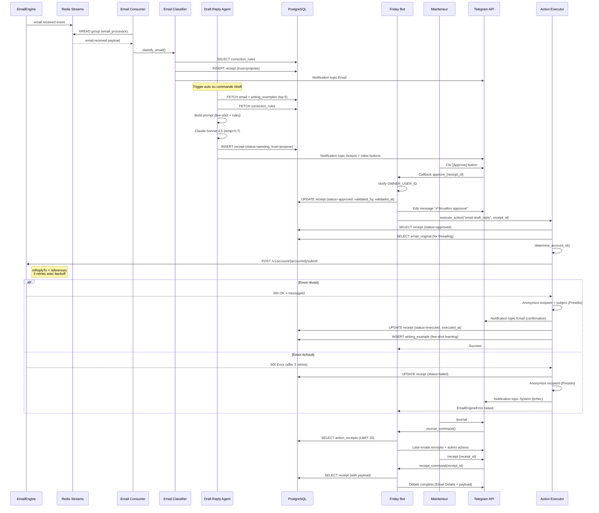

# Workflow Technique : Envoi Emails Approuvés

**Story 2.6** : Pipeline complet email reçu → brouillon → validation → envoi → confirmation

---

## Vue d'Ensemble

```
Email reçu → Classification → Brouillon → [Approve] → Envoi → ✅ Confirmation
                                             ↓             ↓
                                     Receipt approved   Receipt executed
                                             ↓             ↓
                                        DB update    Writing example
```

---

## Diagramme Séquence Complet



---

## Composants & Responsabilités

### 1. EmailEngine (Service externe)

**Rôle** : Réception IMAP + Envoi SMTP

**API Endpoints** :
- `GET /v1/account/{accountId}/messages` — Récupération emails
- `POST /v1/account/{accountId}/submit` — Envoi email
- Webhook : `POST /webhooks/emailengine` → Redis Streams

**Threading** : Gère automatiquement `inReplyTo` + `references` si fournis

**Retry** : 3 tentatives automatiques avec backoff exponentiel

### 2. Redis Streams (Event Bus)

**Events critiques** :
- `email.received` — Nouvel email IMAP reçu
- `email.classified` — Email classifié
- `email.draft_ready` — Brouillon prêt validation
- `email.sent` — Email envoyé avec succès

**Consumer groups** :
- `email_processor` — Traite emails reçus
- `notification_sender` — Envoie notifications Telegram

### 3. PostgreSQL (State Store)

**Tables principales** :
- `ingestion.emails` — Emails bruts + métadonnées
- `core.action_receipts` — Receipts Trust Layer (status transitions)
- `core.writing_examples` — Exemples few-shot learning
- `core.correction_rules` — Règles correction feedback loop

**Status transitions** :
```
pending → approved → executed  (succès)
pending → approved → failed    (échec EmailEngine)
```

### 4. Friday Bot (Telegram Interface)

**Handlers** :
- `/draft` — Génération brouillon manuelle
- `/journal` — Consultation historique actions
- `/receipt` — Détail complet action

**Callbacks** :
- `approve_{receipt_id}` — Validation brouillon → envoi
- `reject_{receipt_id}` — Rejet brouillon
- `edit_{receipt_id}` — Modification brouillon (stub MVP)

**Topics Telegram** :
- **Email & Communications** — Notifications confirmation envoi
- **Actions & Validations** — Inline buttons validation
- **System & Alerts** — Alertes échec envoi

### 5. Action Executor (Story 2.6)

**Fonction principale** : `send_email_via_emailengine()`

**Workflow interne** :
1. Load receipt + email original
2. Verify status='approved'
3. Call EmailEngine API (retry 3x)
4. **Story 2.6 : Notifications** :
   - Succès → Anonymize + notify topic Email
   - Échec → Anonymize + notify topic System
5. Update receipt status (executed/failed)
6. Store writing_example (si succès)

---

## Points d'Attention Critiques

### RGPD & Anonymisation

**RÈGLE** : Toute notification Telegram DOIT anonymiser PII via Presidio

```python
# ✅ CORRECT
recipient_anon = await presidio_anonymize(recipient_email)
subject_anon = await presidio_anonymize(subject)
await bot.send_message(text=f"Email envoyé à {recipient_anon}")

# ❌ WRONG - PII leak
await bot.send_message(text=f"Email envoyé à {recipient_email}")
```

### Error Handling

**RÈGLE** : Notification échec ne bloque JAMAIS workflow

```python
try:
    await send_email_confirmation_notification(...)
except Exception as e:
    logger.warning(f"notification_failed: {e}")
    pass  # Continue workflow
```

### Status Transitions

**RÈGLE** : Receipt status DOIT suivre séquence stricte

```
pending (brouillon prêt)
  ↓ (clic Approve)
approved (validé Mainteneur)
  ↓ (envoi EmailEngine)
executed (envoyé) OU failed (échec)
```

**Anti-pattern** : Passer directement de `pending` → `executed` (skip approved)

---

## Métriques Performance

| Métrique | Cible | Mesure |
|----------|-------|--------|
| **Latence envoi** | <5s | Clic Approve → confirmation |
| **Fiabilité** | >99% | Taux de succès envoi (si EmailEngine healthy) |
| **Retry** | 3 tentatives | Backoff 1s, 2s |
| **Coût** | $0 | Pas d'appel LLM (seulement EmailEngine) |

---

## Dépendances Stories

- **Story 1.6** : Trust Layer (`@friday_action`, receipt status transitions)
- **Story 1.10** : Inline buttons Telegram (callbacks approve/reject)
- **Story 1.11** : Commandes Telegram (`/journal`, `/receipt`)
- **Story 2.1** : EmailEngine Integration (send_message API)
- **Story 2.5** : Brouillons Réponse Email (génération + few-shot learning)

---

**Auteur** : Claude Sonnet 4.5
**Date** : 2026-02-11
**Version** : 1.0.0
**Story** : 2.6 Envoi Emails Approuvés
