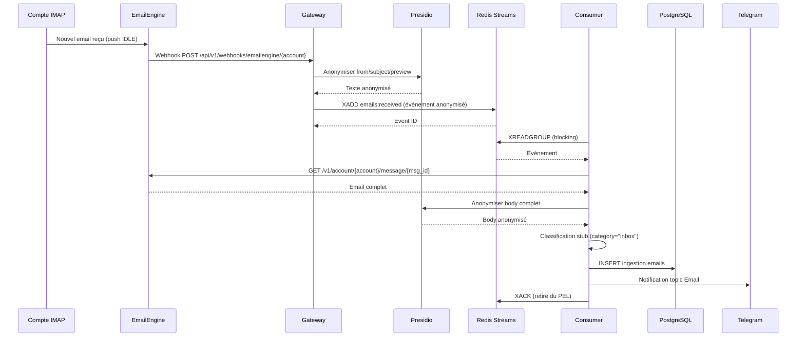

> **[DEPRECATED D25]** Ce guide est obsolete. EmailEngine (PostalSys, 99 EUR/an) a ete remplace par IMAP direct (aioimaplib + aiosmtplib, gratuit).
> Voir : `_docs/plan-d25-emailengine-to-imap-direct.md` pour le plan de migration.
> L'architecture de reception email est desormais : IMAP IDLE (aioimaplib) -> Redis Streams `email.received` -> Consumer -> PostgreSQL.
> L'envoi se fait via aiosmtplib (adaptateur `adapters/email.py`).

# EmailEngine Integration - Story 2.1 [DEPRECATED D25]

Documentation technique intégration EmailEngine pour réception emails IMAP.

**Date**: 2026-02-11
**Author**: Claude Sonnet 4.5
**Status**: ✅ Implemented

---

## Table of Contents

- [Architecture Flow](#architecture-flow)
- [Configuration](#configuration)
- [API Endpoints](#api-endpoints)
- [Redis Streams Format](#redis-streams-format)
- [Troubleshooting](#troubleshooting)
- [Recovery Procedures](#recovery-procedures)

---

## Architecture Flow



**Latence totale** : <30s (NFR1)
**Breakdown** :
- Webhook EmailEngine → Redis : <1s
- Consumer pickup : <5s (BLOCK mode)
- Anonymisation Presidio : <2s
- Fetch email complet : <2s
- Classification stub : <1s
- Stockage PostgreSQL : <1s
- Notification Telegram : <1s

---

## Configuration

### 1. EmailEngine Setup

**Service Docker** : `docker-compose.services.yml`

```yaml
emailengine:
  image: postalsys/emailengine:latest
  container_name: friday-emailengine
  environment:
    - EENGINE_SECRET=${EMAILENGINE_SECRET}
    - EENGINE_ENCRYPTION_KEY=${EMAILENGINE_ENCRYPTION_KEY}
    - DATABASE_URL=postgresql://...
  volumes:
    - emailengine-data:/app/data
  ports:
    - "127.0.0.1:3000:3000"
```

**Variables .env** :
```bash
EMAILENGINE_SECRET=<openssl rand -hex 32>
EMAILENGINE_ENCRYPTION_KEY=<openssl rand -hex 32>
IMAP_MEDICAL_HOST=imap.example.com
IMAP_MEDICAL_PORT=993
IMAP_MEDICAL_USER=user@example.com
IMAP_MEDICAL_PASSWORD=<password>
# ... (4 comptes total)
```

### 2. 4 Comptes IMAP

| Account ID | Usage | IMAP Provider |
|------------|-------|---------------|
| account-medical | Cabinet SELARL (médical) | À configurer |
| account-faculty | Faculté (enseignement) | À configurer |
| account-research | Recherche (thèses) | À configurer |
| account-personal | Personnel | À configurer |

**Script setup** :
```bash
python scripts/setup_emailengine_accounts.py [--dry-run]
```

### 3. Redis AOF (Zero Perte)

**Config** : `config/redis.conf`

```conf
appendonly yes
appendfsync everysec
maxmemory-policy noeviction
```

**Vérification** :
```bash
docker exec friday-redis redis-cli INFO persistence | grep aof_enabled
# Doit retourner: aof_enabled:1
```

### 4. Webhooks Gateway

**Endpoint** : `POST /api/v1/webhooks/emailengine/{account_id}`

**Authentication** : HMAC-SHA256 signature (X-EE-Signature header)

**Script configuration** :
```bash
python scripts/configure_emailengine_webhooks.py [--dry-run]
```

---

## API Endpoints

### EmailEngine API

**Base URL** : `http://localhost:3000`

#### Health
```http
GET /health
```

#### List Accounts
```http
GET /v1/accounts
Authorization: Bearer <EMAILENGINE_SECRET>
```

#### Get Account Info
```http
GET /v1/account/{accountId}
Authorization: Bearer <EMAILENGINE_SECRET>

Response:
{
  "account": "account-medical",
  "state": "connected",
  "email": "user@example.com"
}
```

#### Get Message
```http
GET /v1/account/{accountId}/message/{messageId}
Authorization: Bearer <EMAILENGINE_SECRET>

Response:
{
  "id": "msg_abc123",
  "from": {"address": "sender@example.com", "name": "John Doe"},
  "subject": "Test",
  "text": "Email body...",
  "html": "<p>Email body...</p>",
  "attachments": []
}
```

#### Configure Webhook
```http
POST /v1/account/{accountId}/webhooks
Authorization: Bearer <EMAILENGINE_SECRET>
Content-Type: application/json

{
  "url": "https://gateway.friday.local/api/v1/webhooks/emailengine/{accountId}",
  "events": ["messageNew"],
  "enabled": true
}
```

### Gateway Webhook API

#### Receive EmailEngine Webhook
```http
POST /api/v1/webhooks/emailengine/{account_id}
X-EE-Signature: <hmac-sha256>
Content-Type: application/json

{
  "account": "account-medical",
  "path": "INBOX",
  "event": "messageNew",
  "data": {
    "id": "msg_abc123",
    "from": {"address": "sender@example.com"},
    "subject": "Test",
    "text": "..."
  }
}

Response 200:
{
  "status": "success",
  "account_id": "account-medical",
  "message_id": "msg_abc123",
  "event_id": "1234567890-0"
}
```

---

## Redis Streams Format

### Stream: `emails:received`

**Event Schema** :
```json
{
  "account_id": "account-medical",
  "message_id": "msg_abc123",
  "from_anon": "[EMAIL_1]",
  "subject_anon": "Rendez-vous [DATE_1]",
  "date": "2026-02-11T10:30:00Z",
  "has_attachments": "True",
  "body_preview_anon": "Bonjour [PERSON_1]..."
}
```

**Consumer Group** : `email-processor-group`

**Commands** :
```bash
# Lire événements
redis-cli XREAD STREAMS emails:received 0

# Lire avec consumer group
redis-cli XREADGROUP GROUP email-processor-group consumer-1 STREAMS emails:received >

# Check PEL (Pending Entries List)
redis-cli XPENDING emails:received email-processor-group

# ACK message
redis-cli XACK emails:received email-processor-group <event_id>
```

---

## Troubleshooting

### Problème : EmailEngine container ne démarre pas

**Symptômes** :
```
ERROR: Cannot connect to EmailEngine at http://localhost:3000
```

**Solutions** :
1. Vérifier container running : `docker compose ps emailengine`
2. Vérifier logs : `docker compose logs -f emailengine`
3. Vérifier healthcheck : `docker inspect friday-emailengine | grep Health`
4. Vérifier variables .env : `EMAILENGINE_SECRET`, `EMAILENGINE_ENCRYPTION_KEY`

### Problème : Compte IMAP state=authenticationError

**Symptômes** :
```bash
curl http://localhost:3000/v1/account/account-medical
# Response: "state": "authenticationError"
```

**Solutions** :
1. Vérifier credentials IMAP dans .env
2. Vérifier firewall/réseau (port 993 ouvert)
3. Tester connexion IMAP manuellement : `openssl s_client -connect imap.example.com:993`
4. Vérifier logs EmailEngine : `docker compose logs emailengine | grep authentication`

### Problème : Webhooks non reçus

**Symptômes** :
- Email reçu dans EmailEngine MAIS pas d'événement Redis

**Solutions** :
1. Vérifier webhooks configurés :
   ```bash
   curl -H "Authorization: Bearer $EMAILENGINE_SECRET" \
     http://localhost:3000/v1/account/account-medical/webhooks
   ```
2. Vérifier Gateway logs : `docker compose logs -f gateway`
3. Vérifier signature HMAC : `X-EE-Signature` header valide
4. Tester webhook manuellement :
   ```bash
   python scripts/test_webhook_manual.py
   ```

### Problème : Messages stuck dans PEL

**Symptômes** :
```bash
redis-cli XPENDING emails:received email-processor-group
# Retourne: 50 messages pending
```

**Solutions** :
1. Vérifier consumer running : `docker compose ps email-processor`
2. Vérifier logs consumer : `docker compose logs -f email-processor`
3. Reclaim messages stuck : `bash scripts/recover-stalled-emails.sh`
4. Si erreur récurrente : investiguer logs PostgreSQL/Presidio

### Problème : Latence >30s

**Symptômes** :
- Email reçu → notification Telegram prend >30s

**Breakdown analysis** :
```bash
# Vérifier latency dans logs consumer
docker compose logs email-processor | grep latency_ms
```

**Solutions** :
1. Si Presidio lent (>5s) : vérifier RAM/CPU
2. Si PostgreSQL lent : vérifier index, analyser slow queries
3. Si EmailEngine API lent : vérifier réseau, augmenter timeout
4. Si Redis lent : vérifier AOF fsync policy (`appendfsync everysec`)

---

## Recovery Procedures

### 1. Recover Stalled Messages (PEL)

**Quand** : Messages pending >1h dans Redis PEL

**Procédure** :
```bash
# Check PEL
redis-cli XPENDING emails:received email-processor-group

# Recover automatically
bash scripts/recover-stalled-emails.sh

# Vérifier succès
redis-cli XPENDING emails:received email-processor-group
# Doit retourner: 0 messages pending
```

**Cron** : Quotidien 3h
```cron
0 3 * * * /app/scripts/recover-stalled-emails.sh >> /var/log/friday/recover-emails.log 2>&1
```

### 2. Replay Events (DLQ)

**Quand** : Messages échoués après max retries → DLQ `emails:failed`

**Procédure** :
```bash
# Lire DLQ
redis-cli XREAD STREAMS emails:failed 0

# Republier manuellement dans emails:received
redis-cli XADD emails:received * account_id account-medical message_id msg_abc123 ...

# Supprimer de DLQ après replay
redis-cli XTRIM emails:failed MAXLEN 0
```

### 3. Restore AOF Corrupted

**Quand** : Redis crash + AOF corruption

**Procédure** :
```bash
# 1. Arrêter Redis
docker compose stop redis

# 2. Vérifier/réparer AOF
docker exec friday-redis redis-check-aof --fix /data/appendonly.aof

# 3. Redémarrer Redis
docker compose start redis

# 4. Vérifier intégrité
docker exec friday-redis redis-cli PING
# Doit retourner: PONG
```

### 4. Disaster Recovery (Full)

**Quand** : Perte totale Redis + PostgreSQL

**Prérequis** : Backup quotidien (Story 1.12)

**Procédure** :
1. Restore PostgreSQL depuis backup chiffré age
2. Restore Redis AOF depuis backup
3. Reconfigurer webhooks EmailEngine
4. Vérifier consumer redémarre proprement
5. Test end-to-end : envoyer email test

---

## Performance Metrics

**Capacité** : ~100 emails/jour (VPS-4 48GB)

**Latence** :
- P50: <10s
- P95: <20s
- P99: <30s

**Availability** : 99.9% (downtime max 8.7h/an)

**Zero Loss** : Redis AOF + PEL recovery → perte max 1s de données

---

## References

- [EmailEngine Documentation](https://emailengine.app/docs/)
- [Redis Streams](https://redis.io/docs/data-types/streams/)
- [Presidio](https://microsoft.github.io/presidio/)
- [Story 2.1 File](_bmad-output/implementation-artifacts/2-1-integration-emailengine-reception.md)

---

**Version**: 1.0.0
**Last Updated**: 2026-02-11
