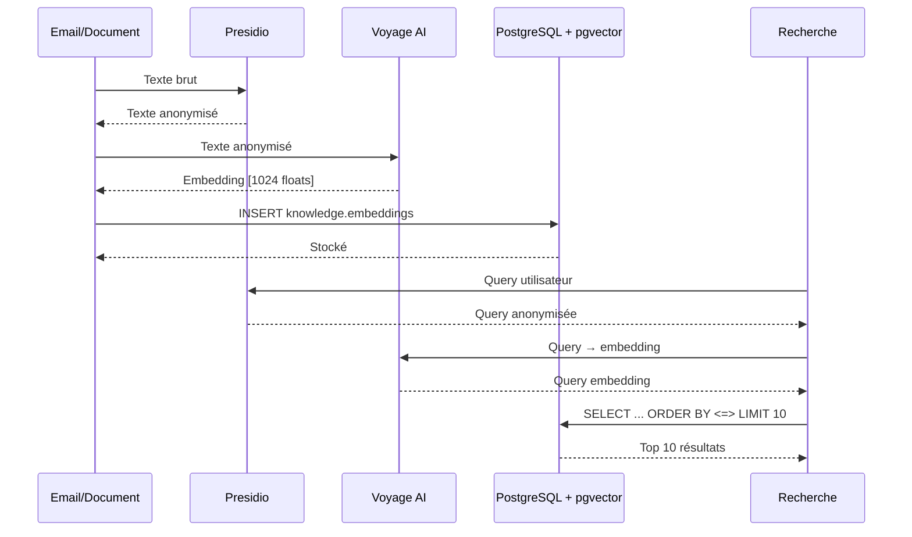

# Friday 2.0 - Embeddings & Recherche Sémantique

**Date**: 2026-02-11
**Story**: 6.2 - Embeddings pgvector
**Provider**: Voyage AI voyage-4-large (1024 dims, multilingual)
**Vectorstore**: PostgreSQL 16 + pgvector v0.8.1 (HNSW index)

---

## Architecture



---

## Configuration

### Variables d'environnement

```bash
# .env
VOYAGE_API_KEY=vo-xxxxxxxxxxxxx
EMBEDDING_PROVIDER=voyage
EMBEDDING_DIMENSIONS=1024
```

### Voyage AI Setup

1. Créer compte : https://www.voyageai.com/
2. Générer API key depuis dashboard
3. Ajouter dans `.env` (chiffré avec SOPS pour production)

**Pricing** : ~$0.06/1M tokens (batch API)
**Budget estimé** : ~10-15 EUR/mois pour Friday (100k embeddings/mois)

---

## Utilisation

### Génération embeddings automatique

**Email** :
```python
# Automatique lors de populate_email_graph()
await populate_email_graph(email_data, memorystore)
# → Embedding généré + stocké dans knowledge.embeddings
```

**Document** :
```python
from agents.src.agents.archiviste.embedding_generator import generate_document_embeddings

count = await generate_document_embeddings(
    document_node_id="doc_123",
    text="Contenu document OCR...",
    vectorstore=vectorstore,
)
# → Retourne nombre d'embeddings générés (chunking si >10k chars)
```

### Recherche sémantique

**API Gateway** :
```bash
POST /api/v1/search/semantic
{
    "query": "facture plombier",
    "top_k": 10,
    "filters": {"node_type": "document"}
}
```

**Telegram** :
```
/search facture plombier
/search SGLT2 diabète
```

**Python** :
```python
from agents.src.adapters.vectorstore import get_vectorstore_adapter

vectorstore = await get_vectorstore_adapter()

# Recherche
results = await vectorstore.search(
    query_embedding=query_emb,
    top_k=10,
    filters={"node_type": "document", "date_range": {"start": "2026-01-01"}}
)

for result in results:
    print(f"{result.node_id}: {result.similarity:.2f}")
```

---

## Spécifications Techniques

### pgvector HNSW Index

```sql
CREATE INDEX idx_embeddings_hnsw ON knowledge.embeddings
USING hnsw (embedding vector_cosine_ops)
WITH (m = 16, ef_construction = 64);
```

**Paramètres** :
- `m=16` : Connexions par nœud (trade-off recall/RAM)
- `ef_construction=64` : Effort build index (trade-off recall/speed)

**Performance** :
- <100ms pour 100k vecteurs (HNSW ANN)
- <500ms pour 300k vecteurs
- Ré-évaluation Qdrant si >300k vecteurs OU latence >100ms

### Chunking Documents

**Paramètres** :
- `CHUNK_SIZE = 2000` chars
- `CHUNK_OVERLAP = 200` chars

**Comportement** :
- Document <10k chars → 1 embedding
- Document >10k chars → N embeddings (1 par chunk)
- Recherche : `MAX(similarity)` par node_id

---

## Sécurité RGPD

⚠️ **CRITIQUE** : Anonymisation Presidio OBLIGATOIRE avant Voyage AI

**Pipeline** :
1. Texte brut (peut contenir PII)
2. → Presidio anonymise
3. → Texte anonymisé envoyé à Voyage AI
4. → AUCUNE PII en clair au cloud

**Mapping éphémère** : Redis TTL 5min pour dé-anonymisation résultats

---

## Monitoring

### Budget API

```bash
# Commande Telegram
/budget

# Output:
💰 Budget API Février 2026
📊 LLM Claude: 42.30 EUR
🔍 Embeddings Voyage: 8.70 EUR
📈 Total: 51.00 EUR / 73.00 EUR
```

### Alertes

- **>20 EUR embeddings/mois** → Alerte Telegram System
- **>80% budget total** → Alerte + email Mainteneur

---

## Troubleshooting

**Erreur : Voyage API down**
- Retry automatique 3x avec backoff
- Email créé quand même (embedding manquant)
- Job nightly retentera génération

**Latence >100ms**
- Vérifier nombre vecteurs : `SELECT COUNT(*) FROM knowledge.embeddings;`
- Si >300k → Considérer migration Qdrant

**Taille index HNSW >10 Go**
- Monitoring : `SELECT pg_total_relation_size('knowledge.idx_embeddings_hnsw');`
- Ajuster paramètres `m` ou `ef_construction`

---

## Migration Provider

Swap Voyage AI → autre provider :

1. Créer adapter dans `agents/src/adapters/vectorstore.py`
2. Ajouter dans factory `get_vectorstore_adapter()`
3. Changer `EMBEDDING_PROVIDER` dans `.env`

**Alternatives** :
- OpenAI : `text-embedding-3-large` (3072 dims, $0.13/1M)
- Cohere : `embed-multilingual-v3.0` (1024 dims, $0.10/1M)
- Ollama local : `nomic-embed-text` (768 dims, gratuit)

---

**Implémenté dans Story 6.2** ✅
