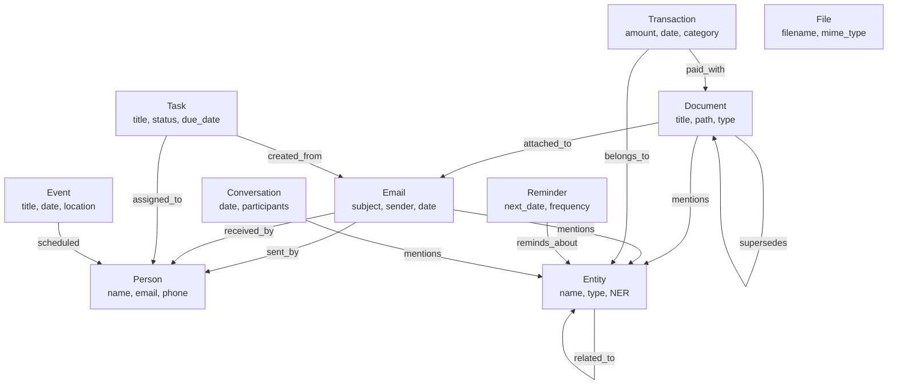

# Schéma du Graphe de Connaissances Friday 2.0

**Version**: 1.0
**Date**: 2026-02-11
**Migration**: 007
**Backend**: PostgreSQL 16 + pgvector (D19)

---

## Vue d'ensemble

Friday 2.0 utilise un graphe de connaissances centralisé stocké dans PostgreSQL (schema `knowledge`) pour relier toutes les informations capturées par les différents modules.

**Principes architecturaux** :
- **10 types de nœuds** : person, email, document, event, task, entity, conversation, transaction, file, reminder
- **14 types de relations** : sent_by, received_by, attached_to, mentions, related_to, assigned_to, created_from, scheduled, references, part_of, paid_with, belongs_to, reminds_about, supersedes
- **Recherche sémantique** : pgvector (embeddings 1024 dims, index HNSW)
- **Historisation** : Colonnes `valid_from`, `valid_to` pour versioning

---

## Diagramme Entité-Relation (Mermaid)



---

## Types de Nœuds (10 types)

### 1. Person
**Utilisation** : Contacts, étudiants, collègues, famille, professionnels

**Propriétés** :
- `name` : Nom complet
- `metadata.email` : Email principal (déduplication)
- `metadata.phone` : Téléphone
- `metadata.organization` : Entreprise/affiliation
- `metadata.role` : Rôle (médecin, plombier, étudiant, etc.)
- `metadata.tags` : Tags personnalisés

**Déduplication** : match sur `metadata.email` OU nom exact

**Exemple** :
```python
person_id = await memorystore.create_node(
    node_type="person",
    name="Dr. Martin",
    metadata={
        "email": "martin@clinique.fr",
        "phone": "+33612345678",
        "organization": "Clinique Saint-Louis",
        "role": "cardiologue"
    },
    source="email"
)
```

---

### 2. Email
**Utilisation** : Emails recus/envoyes via IMAP direct (aioimaplib + aiosmtplib) [D25 : remplace EmailEngine]

**Propriétés** :
- `metadata.message_id` : ID unique email (RFC822, déduplication)
- `metadata.subject` : Sujet
- `metadata.sender` : Expéditeur
- `metadata.recipients` : Liste destinataires
- `metadata.date` : Date d'envoi
- `metadata.category` : Catégorie classification (medical, finance, admin, personal)
- `metadata.priority` : Priorité (urgent, normal, low)
- `metadata.thread_id` : Thread conversation

**Déduplication** : match sur `metadata.message_id`

**Exemple** :
```python
email_id = await memorystore.create_node(
    node_type="email",
    name="RE: Résultats examens cardio",
    metadata={
        "message_id": "<abc123@gmail.com>",
        "subject": "RE: Résultats examens cardio",
        "sender": "martin@clinique.fr",
        "recipients": ["antonio@example.com"],
        "date": "2026-02-11T14:30:00Z",
        "category": "medical",
        "priority": "urgent"
    },
    source="email"
)
```

---

### 3. Document
**Utilisation** : PDF, Docx, scans, articles scientifiques

**Propriétés** :
- `metadata.source_id` : Chemin fichier (déduplication)
- `metadata.filename` : Nom fichier
- `metadata.path` : Chemin complet
- `metadata.doc_type` : Type (facture, contrat, article, these, scan)
- `metadata.date` : Date document
- `metadata.category` : Catégorie (finance, medical, juridique)
- `metadata.author` : Auteur
- `metadata.ocr_text` : Texte extrait OCR

**Déduplication** : match sur `metadata.source_id`

**Exemple** :
```python
doc_id = await memorystore.create_node(
    node_type="document",
    name="Facture_Plombier_250EUR.pdf",
    metadata={
        "source_id": "/nas/documents/finance/2026/02/facture_plombier_250.pdf",
        "filename": "Facture_Plombier_250EUR.pdf",
        "doc_type": "facture",
        "category": "finance",
        "date": "2026-02-11",
        "amount": 250.0
    },
    source="archiviste"
)
```

---

### 4. Event
**Utilisation** : RDV, réunions, deadlines, événements

**Propriétés** :
- `metadata.external_id` : Google Calendar ID (déduplication)
- `metadata.date_start` : Date début
- `metadata.date_end` : Date fin
- `metadata.location` : Lieu
- `metadata.participants` : Liste participants
- `metadata.event_type` : Type (rdv_medical, reunion, deadline)

**Déduplication** : match sur `metadata.external_id`

**Exemple** :
```python
event_id = await memorystore.create_node(
    node_type="event",
    name="RDV cardiologue Dr. Martin",
    metadata={
        "external_id": "gcal_abc123",
        "date_start": "2026-02-15T10:00:00Z",
        "date_end": "2026-02-15T10:30:00Z",
        "location": "Clinique Saint-Louis",
        "participants": ["antonio@example.com", "martin@clinique.fr"],
        "event_type": "rdv_medical"
    },
    source="agenda"
)
```

---

### 5. Task
**Utilisation** : Tâches créées par Friday (extraction emails, reminders, actions)

**Propriétés** :
- `metadata.task_id` : ID tâche (déduplication)
- `metadata.description` : Description complète
- `metadata.status` : Statut (pending, in_progress, completed, cancelled)
- `metadata.priority` : Priorité (high, medium, low)
- `metadata.due_date` : Date limite
- `metadata.assigned_to` : Assigné à (email)
- `metadata.module` : Module créateur (email, heartbeat, archiviste)

**Déduplication** : match sur `metadata.task_id`

**Exemple** :
```python
task_id = await memorystore.create_node(
    node_type="task",
    name="Répondre à email Dr. Martin",
    metadata={
        "task_id": "task_20260211_001",
        "description": "Répondre aux questions sur les examens cardio",
        "status": "pending",
        "priority": "high",
        "due_date": "2026-02-12",
        "assigned_to": "antonio@example.com",
        "module": "email"
    },
    source="email"
)
```

---

### 6. Entity
**Utilisation** : Entités extraites NER (organisations, lieux, concepts médicaux/financiers)

**Propriétés** :
- `metadata.entity_type` : Type NER (PERSON, ORG, LOC, DRUG, DISEASE, CONCEPT)
- `metadata.confidence` : Score NER (0.0-1.0)
- `metadata.aliases` : Alias / variations

**Déduplication** : match sur `LOWER(name)` + `metadata.entity_type`

**Exemple** :
```python
entity_id = await memorystore.create_node(
    node_type="entity",
    name="Metformine",
    metadata={
        "entity_type": "DRUG",
        "confidence": 0.95,
        "aliases": ["Glucophage", "Stagid"]
    },
    source="email"
)
```

---

### 7. Conversation
**Utilisation** : Transcriptions Telegram/Plaud

**Propriétés** :
- `metadata.conversation_id` : ID conversation (déduplication)
- `metadata.date` : Date conversation
- `metadata.duration` : Durée (secondes)
- `metadata.participants` : Liste participants
- `metadata.summary` : Résumé LLM
- `metadata.topics` : Topics extraits

**Déduplication** : match sur `metadata.conversation_id`

---

### 8. Transaction
**Utilisation** : Transactions financières (banque, factures)

**Propriétés** :
- `metadata.transaction_id` : ID transaction (déduplication)
- `metadata.amount` : Montant (float)
- `metadata.currency` : Devise (EUR, USD)
- `metadata.date` : Date transaction
- `metadata.category` : Catégorie (travaux, fournitures, salaire)
- `metadata.account` : Compte (SELARL, SCM, SCI Ravas, SCI Malbosc, Perso)
- `metadata.vendor` : Vendeur/fournisseur
- `metadata.invoice_ref` : Référence facture

**Déduplication** : match sur `metadata.transaction_id`

---

### 9. File
**Utilisation** : Fichiers physiques (photos, audio, vidéos)

**Propriétés** :
- `metadata.file_path` : Chemin fichier (déduplication)
- `metadata.mime_type` : Type MIME
- `metadata.size` : Taille bytes
- `metadata.date` : Date création
- `metadata.tags` : Tags indexation

**Déduplication** : match sur `metadata.file_path`

---

### 10. Reminder
**Utilisation** : Rappels cycliques (entretien voiture, renouvellement contrat)

**Propriétés** :
- `metadata.reminder_id` : ID reminder (déduplication)
- `metadata.next_date` : Prochaine échéance
- `metadata.frequency` : Fréquence (daily, weekly, monthly, yearly)
- `metadata.category` : Catégorie (entretien, administratif, medical)
- `metadata.item_ref` : Référence item (ID voiture, contrat)

**Déduplication** : match sur `metadata.reminder_id`

---

## Types de Relations (14 types)

| Relation | From | To | Sémantique | Exemple |
|----------|------|-----|-----------|---------|
| **sent_by** | Email | Person | Email envoyé par personne | Email → Dr. Martin |
| **received_by** | Email | Person | Email reçu par personne | Email → Antonio |
| **attached_to** | Document | Email | Document attaché à email (PJ) | Facture.pdf → Email |
| **mentions** | Email/Document/Conversation | Entity | Contenu mentionne entité | Email → Metformine |
| **related_to** | Entity | Entity | Relation sémantique générique | Metformine → Diabète |
| **assigned_to** | Task | Person | Tâche assignée à personne | Task → Antonio |
| **created_from** | Task | Email/Conversation | Tâche créée depuis message | Task → Email |
| **scheduled** | Event | Person | Événement implique personne | RDV → Dr. Martin |
| **references** | Document | Document | Document cite/référence autre | Article → Thèse |
| **part_of** | Document | Document | Document partie d'un ensemble | Chapitre → Thèse |
| **paid_with** | Transaction | Document | Transaction liée à facture | Paiement → Facture.pdf |
| **belongs_to** | Transaction | Entity | Transaction appartient à périmètre | Transaction → SELARL |
| **reminds_about** | Reminder | Entity/Document | Rappel concerne item | Reminder → Contrat |
| **supersedes** | Document | Document | Version remplace ancienne | V2 → V1 |

---

## Exemples de Requêtes SQL

### Retrouver tous les emails du Dr. Martin

```sql
SELECT e.id, e.name, e.metadata->>'subject' AS subject, e.created_at
FROM knowledge.nodes e
JOIN knowledge.edges edge ON e.id = edge.from_node_id
JOIN knowledge.nodes p ON edge.to_node_id = p.id
WHERE e.type = 'email'
  AND p.type = 'person'
  AND p.name = 'Dr. Martin'
  AND edge.relation_type = 'sent_by'
ORDER BY e.created_at DESC;
```

---

### Lister toutes les factures non payées

```sql
SELECT d.id, d.name, d.metadata->>'doc_type' AS type, d.created_at
FROM knowledge.nodes d
WHERE d.type = 'document'
  AND d.metadata->>'doc_type' = 'facture'
  AND NOT EXISTS (
      SELECT 1 FROM knowledge.edges e
      JOIN knowledge.nodes t ON e.from_node_id = t.id
      WHERE e.to_node_id = d.id
        AND t.type = 'transaction'
        AND e.relation_type = 'paid_with'
  )
ORDER BY d.created_at DESC;
```

---

### Trouver tous les documents mentionnant "SGLT2"

```sql
SELECT d.id, d.name, d.metadata->>'doc_type' AS type
FROM knowledge.nodes d
JOIN knowledge.edges edge ON d.id = edge.from_node_id
JOIN knowledge.nodes ent ON edge.to_node_id = ent.id
WHERE d.type = 'document'
  AND ent.type = 'entity'
  AND edge.relation_type = 'mentions'
  AND LOWER(ent.name) LIKE '%sglt2%'
ORDER BY d.created_at DESC;
```

---

### Historique complet d'un contrat (versions SUPERSEDES)

```sql
WITH RECURSIVE versions AS (
    -- Version initiale
    SELECT id, name, metadata->>'version' AS version, created_at, 0 AS depth
    FROM knowledge.nodes
    WHERE type = 'document'
      AND name = 'Contrat_Bail_SCI1.pdf'
      AND (metadata->>'version') = '1'

    UNION ALL

    -- Versions suivantes via SUPERSEDES
    SELECT n.id, n.name, n.metadata->>'version', n.created_at, v.depth + 1
    FROM knowledge.nodes n
    JOIN knowledge.edges e ON e.from_node_id = n.id
    JOIN versions v ON e.to_node_id = v.id
    WHERE e.relation_type = 'supersedes'
)
SELECT * FROM versions ORDER BY depth;
```

---

### Tous les événements de Julie dans les 6 prochains mois

```sql
SELECT ev.id, ev.name, ev.metadata->>'date_start' AS date, ev.metadata->>'location' AS lieu
FROM knowledge.nodes ev
JOIN knowledge.edges edge ON ev.id = edge.from_node_id
JOIN knowledge.nodes p ON edge.to_node_id = p.id
WHERE ev.type = 'event'
  AND p.type = 'person'
  AND p.name = 'Julie'
  AND edge.relation_type = 'scheduled'
  AND (ev.metadata->>'date_start')::timestamptz BETWEEN NOW() AND NOW() + INTERVAL '6 months'
ORDER BY (ev.metadata->>'date_start')::timestamptz;
```

---

## Stratégie de Population par Module

| Module Friday | Nœuds Créés | Relations Créées | Trigger |
|--------------|-------------|------------------|---------|
| **Email (Epic 2)** | Person (sender/recipients)<br/>Email<br/>Entity (NER) | SENT_BY, RECEIVED_BY<br/>MENTIONS | Pipeline classification email |
| **Archiviste (Epic 3)** | Document<br/>Entity (NER) | ATTACHED_TO (si PJ email)<br/>MENTIONS<br/>REFERENCES | Upload document / détection NAS |
| **Agenda (Epic 7)** | Event<br/>Person | SCHEDULED<br/>CREATED_FROM (si email) | Sync Google Calendar |
| **Finance (Epic 8)** | Transaction<br/>Entity (périmètre) | PAID_WITH (facture)<br/>BELONGS_TO (compte) | Import bancaire CSV |
| **Plaud (Epic 11)** | Conversation<br/>Entity (NER)<br/>Task | MENTIONS<br/>CREATED_FROM | Transcription audio |
| **Entretien (Epic 16)** | Reminder<br/>Entity (item) | REMINDS_ABOUT | Détection cycle entretien |
| **Thèse (Epic 9)** | Document (chapitres)<br/>Document (sources) | PART_OF<br/>REFERENCES | Analyse Google Docs |

---

## Fallback si Graphe Indisponible

En cas d'indisponibilité du graphe (PostgreSQL down, migration en cours), les modules doivent avoir un **circuit breaker** :

1. **Recherche sémantique pgvector seule** : Si tables `knowledge.nodes/edges` inaccessibles, fallback sur `knowledge.embeddings` uniquement (recherche sans relations)

2. **Mode dégradé sans mémoire** : Si PostgreSQL complètement down, modules critiques (email, heartbeat) continuent avec état éphémère Redis uniquement (perte contexte cross-source)

3. **Health check** : FastAPI `/api/v1/health` vérifie `SELECT 1 FROM knowledge.nodes LIMIT 1` → si échec, alerte Telegram

**Implémentation** : Voir `agents/src/adapters/memorystore.py` → méthode `semantic_search()` avec try/except + circuit breaker.

---

## Migration vers Graphiti/Neo4j (Futur possible)

**Décision D3** : Graphe Day 1 = PostgreSQL (pas Graphiti/Neo4j immature).

**Réévaluation 6 mois (août 2026)** si :
- Graphiti atteint maturité production (v1.0+)
- Requêtes complexes multi-hop deviennent fréquentes (>10% trafic)
- Latence PostgreSQL pathfinding >500ms sur graphe >300k nœuds

**Stratégie migration** : Adaptateur `memorystore.py` masque implémentation → changement backend transparent pour modules Friday.

---

**Auteur** : Claude Sonnet 4.5 (Story 6.1)
**Prochaine révision** : Août 2026 (Epic 20 - Évaluation technique Graphiti/Neo4j)
