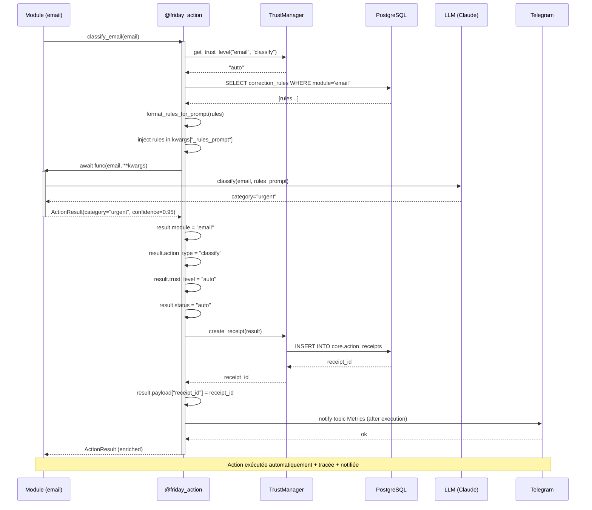
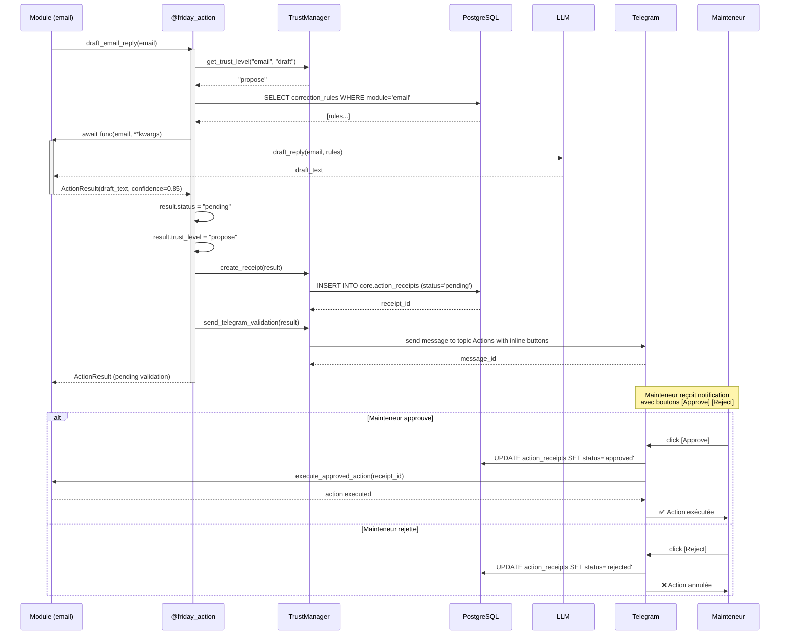
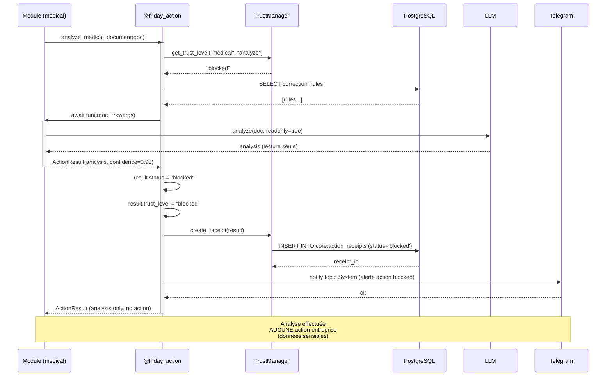
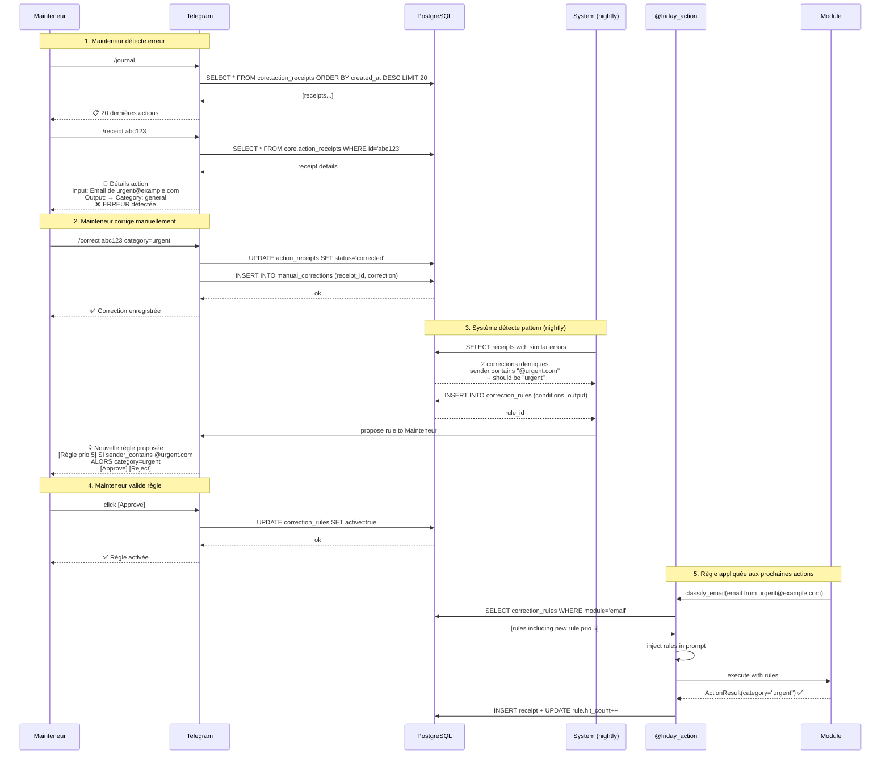
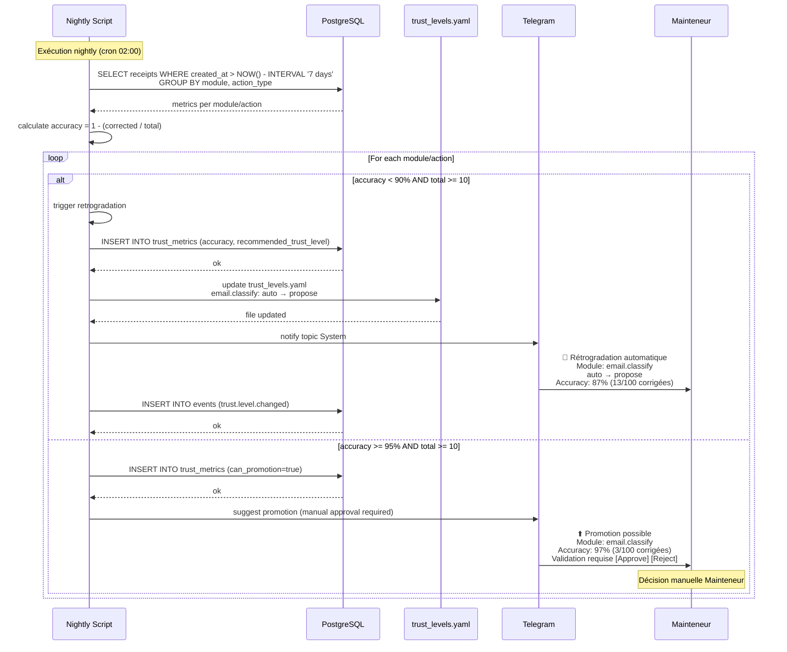

# Trust Layer - Diagrammes de séquence

**Version** : 1.0 (2026-02-09)
**Story** : 1.6 - Trust Layer Middleware

---

## Séquence 1 : Exécution d'une action (trust=auto)

---

## Séquence 2 : Exécution avec validation (trust=propose)

---

## Séquence 3 : Action bloquée (trust=blocked)

---

## Séquence 4 : Feedback Loop (correction → règle)

---

## Séquence 5 : Rétrogradation automatique (accuracy < 90%)

---

## Légende

### Acteurs

| Acteur | Description |
|--------|-------------|
| **M** (Module) | Module métier (email, archiviste, etc.) |
| **D** (@friday_action) | Décorateur Trust Layer |
| **TM** (TrustManager) | Gestionnaire du Trust Layer |
| **PG** (PostgreSQL) | Base de données (receipts, rules, metrics) |
| **L** (LLM) | Claude Sonnet 4.5 API |
| **T** (Telegram) | Bot Telegram (5 topics) |
| **A** (Mainteneur) | Utilisateur final |
| **S** (System) | Scripts nightly/monitoring |
| **Y** (YAML) | Fichier config/trust_levels.yaml |

### Statuts receipt

| Statut | Signification |
|--------|---------------|
| **auto** | Action exécutée automatiquement |
| **pending** | En attente de validation Telegram |
| **approved** | Validée par Mainteneur via inline button |
| **rejected** | Refusée par Mainteneur ou erreur |
| **corrected** | Corrigée manuellement par Mainteneur |

### Trust levels

| Level | Comportement |
|-------|--------------|
| **auto** | Exécute + notifie après |
| **propose** | Prépare + attend validation |
| **blocked** | Analyse seule, jamais d'action |

---

## Voir aussi

- [Guide d'utilisation](./trust-layer-usage.md) - Documentation complète
- [Architecture addendum §7](../_docs/architecture-addendum-20260205.md#7) - Formules
- [Migration 011](../database/migrations/011_trust_system.sql) - Tables SQL
